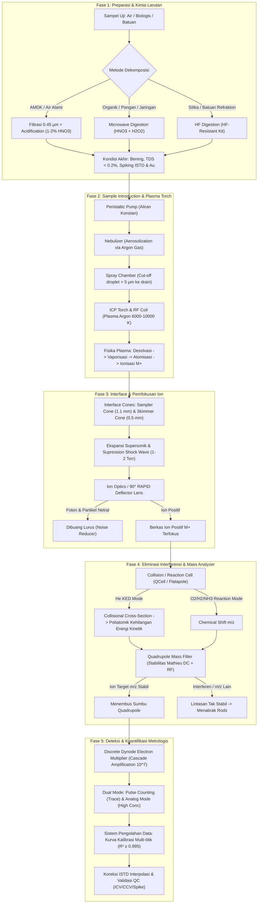

# 🗺️ Peta Jalan Memahami Analisis Logam Menggunakan ICP-MS (First-Principles Roadmap)

> **Kompas Belajar:**  
> ICP-MS (*Inductively Coupled Plasma Mass Spectrometry*) bukanlah sekadar "kotak hitam" pembaca ppm/ppb. Instrumen ini adalah sebuah rangkaian transisi materi ekstrem: mengubah cairan pekat menjadi aerosol mikroskopis, mendisintegrasikannya dalam plasma bersuhu matahari (~6000 - 10000 K), mengekstraksi ion melewati gradien tekanan supersonik (1 atm -> 10⁻⁷ Torr), menyaring ion berdasarkan rasio m/z dalam medan listrik bolak-balik, dan melipatgandakan 1 tumbukan ion menjadi jutaan elektron.

---

## 🧭 Arsitektur Alur Analisis End-to-End

---

## 🏛️ 6 Tonggak Utama Pembelajaran (The 6 Milestones)

---

### 📍 Tonggak 1: Fondasi Fisika Atomik & Termodinamika Ionisasi
*Memahami mengapa dan bagaimana atom berubah wujud menjadi ion terukur.*

- [x] **1.1. Hierarki Eksitasi Atomik: AAS vs ICP-OES vs ICP-MS** *(Selesai didekonstruksi di [[perbandingan-spektrometri-emisi-dan-massa]])*
  - Mengapa absorbsi optik (AAS) dan emisi optik (OES) terbatasi oleh dinamika linier (10³ - 10⁶), sedangkan deteksi ion langsung (MS) bisa mencapai 10⁹ (ppt hingga ppq)?
  - Batas deteksi vs fleksibilitas multi-unsur.
- [x] **1.2. Termodinamika Plasma Argon & Kesetimbangan Saha-Eggert** *(Selesai didekonstruksi di [[perbandingan-spektrometri-emisi-dan-massa]])*
  - Energi ionisasi pertama ($IE_1$) Argon = $15.76\text{ eV}$.
  - Mengapa hampir semua logam ($IE_1 < 10\text{ eV}$) terionisasi $> 90-99\%$ dalam plasma $7000\text{ K}$, sementara non-logam/metaloid ($As, Se, Hg, Cl$) memiliki derajat ionisasi jauh lebih rendah?
- [x] **1.3. Rasio Massa terhadap Muatan ($m/z$) dan Fenomena Isotopic Abundance** *(Selesai didekonstruksi di [[icp-ms-interferensi-dan-qcell-ked]])*
  - Definisi operasional $m/z$: ion dominan bermuatan tunggal ($M^+$) vs ion bermuatan ganda ($M^{2+}$, muncul di $m/2$).
  - Kelimpahan isotop alami: mengapa kita memilih isotop tertentu untuk kuantifikasi (misal $^{66}\text{Zn}$ vs $^{64}\text{Zn}$, atau $^{111}\text{Cd}$ vs $^{114}\text{Cd}$)?

> 🎯 **Submarine Layer -2 Focus:**  
> Persamaan Saha-Eggert: $\frac{n_{i} n_{e}}{n_{a}} = \frac{2 g_i}{g_a} \left(\frac{2\pi m_e k T}{h^2}\right)^{3/2} e^{-\frac{E_i}{kT}}$

---

### 📍 Tonggak 2: Kimia Larutan & Preparasi Sampel (Sample Preparation)
*ICP-MS sangat sensitif, yang berarti ia juga sangat mudah terkontaminasi dan rusak oleh matriks larutan.*

- [ ] **2.1. Batasan Fisik Instrumen: Toleransi TDS (*Total Dissolved Solids*)**
  - Mengapa larutan sampel ICP-MS **wajib memiliki TDS $< 0.2\%$ ($< 2000\text{ ppm}$)**, dan idealnya $< 0.1\%$?
  - Apa yang terjadi pada lubang *orifice cone* ($\approx 1\text{ mm}$) jika larutan bergaram tinggi diinjeksi?
- [ ] **2.2. Strategi Dekomposisi: Wet Digestion vs Dry Ashing**
  - Kelemahan fatal *Dry Ashing* (furnace $550^\circ\text{C}$) terhadap unsur volatil ($As, Hg, Se, Pb, Cd$).
  - Keunggulan *Closed-Vessel Microwave Digestion* (suhu $\sim 195^\circ\text{C}$, tekanan puluhan bar): retensi analit volatil, konsumsi asam minimal, waktu destruksi singkat.
- [ ] **2.3. Kimia Reagen Asam & Kompatibilitas Matriks**
  - **$\text{HNO}_3$ (Ultrapure)**: Mengapa menjadi pelarut utama tak tergantikan di ICP-MS? (Fisika di balik matriks $H, N, O$).
  - **$\text{HCl}$**: Kapan wajib digunakan (stabilisasi $Au, Pt, Pd, Hg, Sn$), dan mengapa dihindari untuk analit $As$ dan $V$ ($^{40}\text{Ar}^{35}\text{Cl}^+$ dan $^{35}\text{Cl}^{16}\text{O}^+$)?
  - **$\text{HF}$**: Melarutkan silikat & refraktori ($Ti, Zr, W, Nb$). Mengapa butuh *inert sample intro kit* (PFA/sapphire spray chamber & torch)?
  - **$\text{H}_2\text{SO}_4$ & $\text{HClO}_4$**: Mengapa dilarang keras/sangat dihindari pada ICP-MS rutin?
- [ ] **2.4. Kontrol Kontaminasi & Efek Memori (Memory Effect)**
  - Mengapa botol kaca dilarang dan harus menggunakan plastik asam-tercuci (*acid-washed* PE/PP/PFA)?
  - Mekanisme stabilisasi Merkuri ($Hg$) menggunakan penambahan trace Gold ($\text{Au}^{3+} \approx 200\ \mu\text{g/L}$).

---

### 📍 Tonggak 3: Arsitektur Instrumen & Rekayasa Lintasan Ion
*Membedah setiap modul mekanik dari botol sampel hingga detektor.*

- [ ] **3.1. Sistem Introduksi Sampel (Sample Introduction)**
  - **Peristaltic Pump & Tubing**: pulsasi, laju alir ($\sim 400\ \mu\text{L/min}$), dan relaksasi tubing.
  - **Nebulizer (Concentric / MicroMist)**: Efek Venturi dan disrupsi fluida gas-cair.
  - **Spray Chamber (Cyclonic / Scott)**: Penyaringan droplet berdasarkan momentum dan gravitasi. Mengapa hanya $\sim 1-2\%$ droplet ($< 5\ \mu\text{m}$) yang boleh masuk ke torch?
- [ ] **3.2. Pembangkit Plasma (ICP Torch & RF Induction)**
  - Tiga aliran gas Argon: Plasma gas ($12-18\text{ L/min}$), Auxiliary gas ($0.75-2\text{ L/min}$), Nebulizer/Carrier gas ($\sim 1\text{ L/min}$).
  - Transfer energi RF (daya $750-1500\text{ W}$, frekuensi $27/40\text{ MHz}$) ke elektron melalui koil induksi.
  - 4 zona plasma aksial: *Desolvation $\to$ Vaporization $\to$ Atomization $\to$ Ionization*.
- [ ] **3.3. Interface System & Fisika Vakum Bertingkat**
  - Transisi dari tekanan atmosfer ($760\text{ Torr}$) ke High Vacuum ($10^{-4}\text{ Torr}$) dan Ultra-High Vacuum ($10^{-7}\text{ Torr}$).
  - *Sampler Cone* (lubang $\sim 1.0\text{ mm}$) dan *Skimmer Cone* (lubang $\sim 0.5\text{ mm}$).
  - Pembentukan *supersonic jet expansion* dan *Mach disk*. Mengapa posisi ujung skimmer cone harus tepat berada di *zone of silence*?
  - Perbedaan material: Nickel (Ni) cone vs Platinum (Pt) cone (kapan harus menggunakan Pt?).
- [ ] **3.4. Ion Optics & Background Suppression**
  - Efek *Space-Charge*: Mengapa ion-ion berat bermuatan positif cenderung menolak ion-ion ringan ke luar sumbu berkas ion?
  - Pembelokan 90° (*RAPID deflector lens*): Bagaimana ion diarahkan ke quadrupole sementara foton dan partikel netral lolos lurus ke peredam?
- [x] **3.5. Mass Analyzer: Quadrupole Filter** *(Selesai didekonstruksi di [[mekanika-quadrupole-rf-dc]])*
  - Fisika batang elektroda hiperbolik 4 kutub.
  - Kombinasi potensial statis (DC, $U$) dan potensial dinamis frekuensi radio (RF, $V \cos(\omega t)$).
  - Diagram kestabilan Mathieu ($a, q$): Mengapa ion berat menabrak DC(-) dan mengapa ion ringan menabrak DC(+) via resonansi parametrik / overshoot mangkuk potensial.
- [ ] **3.6. Detektor: Discrete Dynode Electron Multiplier**
  - Konversi tumbukan ion positif menjadi emisi elektron sekunder.
  - *Cascade amplification* ($10^7 - 10^8$ elektron per ion).
  - Transisi otomatis dari *Pulse Counting Mode* ke *Analog Mode*.

---

### 📍 Tonggak 4: Dinamika Interferensi & Resolusi Spektral
*Tantangan terbesar operator ICP-MS: membedakan sinyal analit asli dari "hantu" spektral.*

- [x] **4.1. Interferensi Spektral** *(Selesai didekonstruksi di [[icp-ms-interferensi-dan-qcell-ked]])*
  - **Isobarik**: Dua unsur isotop stabil bermassa nominal identik ($^{114}\text{Cd}$ vs $^{114}\text{Sn}$, $^{40}\text{Ca}$ vs $^{40}\text{Ar}$).
  - **Poliatomik**: Gabungan komponen plasma ($Ar, O, N, H$) dan matriks sampel ($Cl, S, C$):
    - $^{40}\text{Ar}^{16}\text{O}^+$ mengganggu $^{56}\text{Fe}^+$
    - $^{40}\text{Ar}^{35}\text{Cl}^+$ mengganggu $^{75}\text{As}^+$
    - $^{35}\text{Cl}^{16}\text{O}^+$ mengganggu $^{51}\text{V}^+$
    - $^{40}\text{Ar}^{40}\text{Ar}^+$ mengganggu $^{80}\text{Se}^+$
  - **Doubly Charged ($M^{2+}$)**: Ion bermuatan $+2$ muncul di setengah massanya ($^{136}\text{Ba}^{2+}$ mengganggu $^{68}\text{Zn}^+$).
- [x] **4.2. Mekanisme Resolusi Interferensi** *(Selesai didekonstruksi di [[icp-ms-interferensi-dan-qcell-ked]])*
  - **KED (Kinetic Energy Discrimination) dengan Gas Helium**:
    - Perbedaan ukuran fisik (*collision cross-section*): poliatomik lebih besar dari monoatomik.
    - Frekuensi tumbukan dengan Helium $\to$ degradasi energi kinetik poliatomik $\to$ penyaringan via *Potential Energy Barrier*.
  - **Flatapole QCell (Thermo iCAP Q)**: Trade-off mode STD vs KED, collisional focusing, dan *dynamic low-mass cut-off*.
  - **Reaction Cell Mode ($\text{O}_2, \text{H}_2, \text{NH}_3$)**:
    - Termodinamika reaksi fase gas (*gas-phase ion-molecule reactions*).
    - Mass shifting analit (misal $^{75}\text{As}^+ + \text{O}_2 \to\ ^{91}[\text{AsO}]^+$).
  - **Koreksi Matematika Isobarik**: Persamaan koreksi elemental (*Inter-Element Correction Equations*).
- [ ] **4.3. Interferensi Non-Spektral (Matrix Effects & Physical Suppression)**
  - Supresi ionisasi di plasma akibat analit matriks mudah terionisasi (*EIE - Easily Ionized Elements* seperti $Na, K$).
  - Perubahan viskositas dan tegangan permukaan terhadap efisiensi nebulisasi.
  - Strategi mitigasi: Pengenceran (*dilution factor*), *Matrix Matching*, *Method of Standard Additions* (MSA).

---

### 📍 Tonggak 5: Tuning Harian, Validasi Metrologis & QA/QC
*Menjamin data analitik absah, presisi, telusur, dan defensible di mata standar ISO 17025.*

- [ ] **5.1. Protokol Start-Up & Daily Tuning Check**
  - Larutan tuning ($1\text{ ppb}$ Li, Co, In, Ce, Ba, Bi, U).
  - Parameter kunci keberterimaan (kriteria Thermo iCAP Q):
    - Sensitivitas sinyal (misal $^7\text{Li} > 30.000\text{ cps}$, $^{115}\text{In} > 132.000\text{ cps}$, $^{238}\text{U} > 150.000\text{ cps}$).
    - **Oxide Ratio ($^{140}\text{Ce}^{16}\text{O}^+/^{140}\text{Ce}^+$)**: Wajib $\le 2\% - 3\%$ (indikator plasma dingin / oksigen berlebih).
    - **Doubly Charged Ratio ($^{137}\text{Ba}^{++}/^{137}\text{Ba}^+$)**: Wajib $\le 3\% - 5\%$ (indikator ionisasi berlebih / energi plasma).
    - **Background Noise**: $< 1 - 4\text{ cps}$ pada rentang massa kosong ($m/z\ 4.5$ dan $220.7$).
    - **KED Mode Check**: Ratio $^{59}\text{Co}/^{35}\text{Cl}^{16}\text{O} > 18\%$.
- [ ] **5.2. Metrologi Kalibrasi & Standardisasi Internal (ISTD)**
  - Kurva kalibrasi multi-level ($R^2 \ge 0.995$ atau $0.999$).
  - Peran *Internal Standard* ($Sc, Ge, Rh, In, Tb, Bi$): mengkompensasi variasi fisik injeksi dan drift instrumen sepanjang batch.
  - Interpolasi ISTD berbasis kemiripan massa dan energi ionisasi.
- [ ] **5.3. Batch Quality Control (QC) Hierarchy**
  - *Method Blank* / *Calibration Blank* ($< \text{MDL}$).
  - *Initial Calibration Verification (ICV)* & *Continuing Calibration Verification (CCV)*: Recovery $90 - 110\%$.
  - *Matrix Spike (MS)* & *Matrix Spike Duplicate (MSD)*: Recovery $75 - 125\%$, RPD $\le 20\%$.
  - Batas Deteksi: Perhitungan $\text{LOD} = 3 \times \frac{s_b}{m}$ dan $\text{LOQ} = 10 \times \frac{s_b}{m}$.

---

### 📍 Tonggak 6: Pemeliharaan Rutin, Diagnostik & Falsification Lab
*Memahami cara instrumen rusak agar tahu cara menjaganya tetap prima.*

- [ ] **6.1. Siklus Pemeliharaan Berkala**
  - **Harian**: Cek chiller ($20 \pm 2^\circ\text{C}$), tekanan suplai gas Ar ($5-6\text{ bar}$ / $100\text{ psi}$), regulator He ($2\text{ bar}$), warm-up 30 menit, pembilasan asam nitrat $0.5\text{ N}$ lalu air ultra murni $18.2\text{ M}\Omega\cdot\text{cm}$.
  - **Mingguan**: Cuci nebulizer menggunakan *Eluo Nebulizer Cleaner* (back-flush), inspeksi elastisitas tubing peristaltik (masa pakai ideal $\approx 40$ jam kerja).
  - **Bulanan**: Pembersihan sampler & skimmer cone dalam asam format $5-10\%$ atau Aqua Regia encer via ultrasonic bath (catatan: wadah terpisah), pembersihan spray chamber & injector torch.
- [ ] **6.2. Logika Troubleshooting Mandiri (Falsification Lab)**
  - Skenario A: *Oxide ratio* tiba-tiba melonjak $> 3\%$ $\to$ Mengapa laju alir nebulizer gas yang terlalu tinggi mendinginkan plasma?
  - Skenario B: Sinyal analit dan ISTD mendadak turun bersamaan sebesar $50\%$ di tengah antrean batch $\to$ Apakah orifice cone terblokir atau pompa peristaltik selip?
  - Skenario C: Sinyal Arsenik ($^{75}\text{As}$) terbaca sangat tinggi pada sampel larutan garam fisiologis ($0.9\%\ \text{NaCl}$) padahal sampel bebas As $\to$ Bukti interferensi poliatomik $^{40}\text{Ar}^{35}\text{Cl}^+$ akibat kegagalan KED mode.

---

## 🎯 Rekomendasi Urutan Belajar & Tautan Catatan Vault

1. Buka dan lengkapi catatan inti: [[prinsip-dasar-icp-ms]].
2. Buat catatan dekonstruksi mendalam untuk tiap komponen hardware:
   - [[sample-introduction-and-nebulization]]
   - [[icp-plasma-physics-and-saha-equation]]
   - [[interface-cones-and-vacuum-mechanics]]
   - [[collision-reaction-cell-and-ked-mode]]
   - [[quadrupole-and-mathieu-stability]]
   - [[electron-multiplier-detector]]
3. Buat SOP & Chem notes:
   - [[microwave-acid-digestion-protocols]]
   - [[spectral-and-non-spectral-interferences]]
   - [[icp-ms-qa-qc-and-metrology]]
