# 🧠 Catatan Kritis ICP-MS: Larutan Tuning, Regulasi QC, Data Pipeline & Realita Meja Lab

> **One-Sentence Core Insight:**  
> Kualitas data ICP-MS ditentukan oleh rantai tak terputus: kinetika dekomposisi di bejana preparasi $\to$ kestabilan energi plasma (tuning CeO & Ba²⁺) $\to$ normalisasi ratiometric internal standard $\to$ konversi gravimetri-volumetri berpagar hierarki QC kompendial.

---

## 1. First-Principles Larutan Tuning (Li, Co, In, Ba, Ce, U)

Mengapa campuran unsur ini yang dipilih dalam larutan tuning harian (misal Thermo Qtegra Tuning Solution)? Setiap unsur mewakili rezim fisika spesifik pada spektrometer massa:

```
[Massa Rendah: 7-Li]  ────────► [Massa Menengah: 59-Co, 115-In] ────────► [Massa Tinggi: 238-U]
                                (Optimasi Voltase Lensa RAPID)

[Barium: Ba-138]      ────────► Indikator Ionisasi Ganda (M²⁺ / M⁺ < 3%) ──► Plasma Terlalu Panas?
[Cerium: Ce-140]      ────────► Indikator Pembentukan Oksida (CeO⁺/Ce⁺ < 2%) ──► Plasma Terlalu Dingin?
```

### A. Rasio Oksida ($\text{CeO}^+/\text{Ce}^+ < 2\%$) — Sensor "Plasma Terlalu Dingin / Terlalu Basah"
- **Energi Disosiasi Ikatan**: Ikatan $\text{Ce}-\text{O}$ memiliki energi disosiasi salah satu yang tertinggi di tabel periodik ($\approx 8.2\text{ eV}$ atau $790\text{ kJ/mol}$).
- **Mekanika**: Jika plasma argon ($\sim 7000\text{ K}$) tidak memiliki energi termal yang cukup untuk memutuskan ikatan terkuat ini, atom analit lain akan terancam gagal teratomisasi dan membentuk oksida pengganggu (misal $^{40}\text{Ar}^{16}\text{O}^+$ pada $^{56}\text{Fe}$).
- **Akar Masalah Jika Rasio Tinggi**: Laju gas carrier nebulizer terlalu kencang (meniup plasma hingga dingin) atau ada kelembapan berlebih dari aerosol.

### B. Rasio Muatan Ganda ($\text{Ba}^{2+}/\text{Ba}^+ < 3\%$) — Sensor "Plasma Terlalu Panas / Over-Ionized"
- **Energi Ionisasi Relatif**:
  - Energi ionisasi Argon: $IE_1(\text{Ar}) = \mathbf{15.76\text{ eV}}$.
  - Energi ionisasi pertama Barium: $IE_1(\text{Ba}) = 5.21\text{ eV} \to \text{Ba}^+$.
  - Energi ionisasi **kedua** Barium: $IE_2(\text{Ba}) = \mathbf{10.00\text{ eV}}$.
- **Mekanika**: Karena $IE_2(\text{Ba}) = 10.00\text{ eV} < 15.76\text{ eV}$, Barium sangat rentan terionisasi dua kali menjadi $\text{Ba}^{2+}$. Ion $\text{Ba}^{2+}$ akan terbaca di $m/z = 138/2 = \mathbf{69}$ (menimpa Galium $^{69}\text{Ga}$).
- **Akar Masalah Jika Rasio Tinggi**: Daya RF terlalu tinggi atau posisi *sampling depth* torch terlalu dekat ke orifice cone.

### C. Profil Transmisi Lensa (Li, Co, In, U)
- Lensa elektrostatik (seperti *RAPID 90° deflector*) harus memfokuskan berkas ion secara seragam.
- Mengamati respons cps dari $^7\text{Li}$ (ringan), $^{59}\text{Co}$ & $^{115}\text{In}$ (sedang), hingga $^{238}\text{U}$ (berat) menjamin tidak ada diskriminasi massa akibat *space-charge effect*.

---

## 2. Audit Kritis Regulasi QC: ISO/IEC 17025 vs EPA Compendial Methods

> [!WARNING]
> **Koreksi Mitos Laboratorium**:  
> ISO/IEC 17025 **TIDAK PERNAH** secara kaku mewajibkan bahwa SETIAP batch pengujian harus memuat Blank, CCV, CRM, dan Spike secara bersamaan.

### A. Apa yang Sebenarnya Dimandatkan ISO/IEC 17025:2017 Klausul 7.7?
- ISO 17025 adalah **standar payung sistem manajemen kompetensi**, bukan buku resep prosedur uji.
- Klausul 7.7.1 menyatakan lab harus memiliki prosedur pemantauan keabsahan hasil, dengan memilih alat yang sesuai (*where appropriate*): bahan acuan (CRM), standar kerja (control chart), replikat, uji banding, dsb.

### B. Dari Mana Asal Aturan Batching "Blank + CCV + Spike + Duplicate"?
Aturan kaku per-batch ($\le 20$ sampel) berasal dari **Metode Kompendial Standar**, terutama:
- **US EPA Method 200.8** & **EPA Method 6020B**:
  - **Method Blank (MB)**: 1 per batch.
  - **Continuing Calibration Verification (CCV / CS 500 ppb)**: Tiap 10 sampel (toleransi $90-110\%$).
  - **Matrix Spike (MS / LFM)**: 1 per batch (toleransi $70-130\%$).
  - **Duplicate Sample (LD / Simplo-Duplo)**: 1 per batch ($\text{RPD} \le 20\%$).

### C. Realitas Operasional CRM di Lab Komersial
- **Faktor Biaya**: CRM bersertifikat (NIST, ERM) berharga jutaan rupiah per botol kecil.
- **Praktek Harian**: Batch rutin harian (seperti pada [[isi-ppt]]) biasanya mengandalkan **Blank Mars + CCV + Duplo + Spike**.
- **Kapan CRM Digunakan?**: Saat validasi/verifikasi metode awal, pergantian lot reagen/analis, uji profisiensi (PT), atau audit berkala.

---

## 3. Pipa Transformasi Data (Dari Pulsa Listrik ke Laporan Jadi)

```mermaid
flowchart LR
    A["Detektor EM: cps"] -->|Normalisasi Otomatis| B["Rasio Sinyal: cps Analit / cps ISTD"]
    B -->|Regresi Qtegra R² ≥ 0.995| C["Konsentrasi Larutan: C_meas (ppb / µg/L)"]
    C -->|Ekspor ke Excel Mentah| D["Spreadsheet Olah Data"]
    D -->|Koreksi Blank & Master Formula| E["Konsentrasi Padatan: W (mg/kg)"]
    E -->|Filter LOD / LOQ| F["Laporan Akhir / CoA (< LOQ atau X ± U)"]
```



#### A. Level 1: Di Software Qtegra (Black Box Processing)
1. **Normalisasi Internal Standard (ISTD)**:
   $$R_{\text{analit}} = \frac{\text{cps}_{\text{analit}}}{\text{cps}_{\text{ISTD}}}$$
   *Mengapa? Mengoreksi drift pompa peristaltik, fluktuasi plasma, dan clogging mikro cone selama batch berjalan.*
2. **Fitting Kalibrasi Multi-titik**: Menghitung konsentrasi larutan dalam vial ($C_{\text{meas}}$ dalam $\mu\text{g/L}$).

#### B. Level 2: Di Spreadsheet Meja Lab (The Master Formula)
Software tidak tahu massa penimbangan di neraca analitik dan volume labu takar di ruang preparasi:

$$W_{\text{analit}}\ (\text{mg/kg atau ppm}) = \frac{(C_{\text{sampel}} - C_{\text{blank}})\ [\mu\text{g/L}] \times V\ [\text{mL}] \times dF}{m_{\text{sampel}}\ [\text{g}] \times 1000}$$

- $V$ = Volume labu takar akhir ($50\text{ mL}$).
- $m_{\text{sampel}}$ = Massa penimbangan padat ($\approx 0.2000\text{ g}$).
- $dF$ = Faktor pengenceran lanjutan (jika diencerkan lagi, misal $10\times$).
- Pembagi $1000$ = Konversi dimensi satuan:
  $$\frac{\mu\text{g}}{\text{L}} \times \text{mL} \times \frac{1}{\text{g}} \times \frac{1\text{ L}}{1000\text{ mL}} = \frac{\mu\text{g}}{1000\ \text{g}} = \frac{\text{mg}}{\text{kg}}$$

#### C. Level 3: Aturan Sensorik Metrologi (LOD & LOQ)
- **Haram Menulis `0.00`**: Jika hasil hitungan $< \text{LOQ}$, wajib dilaporkan sebagai **`"< LOQ"`** (misal `< 0.01 mg/kg`). Menulis `0.00` salah secara epistemik karena instrumen hanya tidak mampu mendeteksi, bukan membuktikan analit nihil mutlak di alam.
- **Logika Excel Lab**: Rumus `=IF(hasil < LOQ, "< LOQ", hasil)` mencegah angka negatif ekstrapolasi regresi masuk ke sertifikat hasil.

---

## 4. Kinetika Reaksi Preparasi: Walet vs Sedimen

Mengapa di lab prosedur penutupan bejana microwave (*vessel capping*) berbeda antar sampel?

| Jenis Sampel | Reagen Asam | Perlakuan Sebelum Tutup Vessel | Dasar Kinetika Reaksi (First-Principles) |
| :--- | :--- | :--- | :--- |
| **Sarang Burung Walet (EBN)** | $\text{HNO}_3$ Pekat murni | **Bisa langsung ditutup rapat** | Matriks protein kering. Energi aktivasi pemutusan ikatan peptida oleh $\text{HNO}_3$ tinggi; reaksi sangat lambat di suhu ruang ($25^\circ\text{C}$). Reaksi baru aktif di microwave ($> 140–190^\circ\text{C}$). |
| **Sedimen / Batuan / Mineral** | Campuran $\text{HNO}_3 + \text{HCl}$ (Aqua Regia / Reverse) | **Wajib degassing 15–30 menit** di ruang asam | 1. $\text{HNO}_3 + 3\text{HCl} \to \text{NOCl}_{(g)} + \text{Cl}_{2(g)} + 2\text{H}_2\text{O}$ bereaksi spontan pada suhu ruang.<br>2. Reaksi effervescence karbonat: $\text{CaCO}_3 + 2\text{H}^+ \to \text{Ca}^{2+} + \text{H}_2\text{O} + \mathbf{CO}_2\uparrow$ menghasilkan lonjakan tekanan gas dingin yang bisa meledakkan katup jika langsung disegel. |

---

## 5. Ringkasan Spektral vs Non-Spektral Interferensi

- **Spektral (Masalah Identitas / False Positive)**:
  - Spesies pengganggu memiliki rasio $m/z$ identik dengan analit.
  - *Contoh*: $^{40}\text{Ar}^{35}\text{Cl}^+$ menimpa $^{75}\text{As}^+$ pada $m/z = 75$.
  - *Solusi Utama*: **Collision Cell (KED Helium)**. Ukuran ion poliatomik lebih besar $\to$ lebih sering bertumbukan dengan gas He $\to$ kehilangan energi kinetik lebih banyak $\to$ diblokir oleh *energy barrier* di exit lens.
- **Non-Spektral (Masalah Hambatan Fisis / Signal Suppression)**:
  - Tidak ada ion kembar di $m/z$, tapi matriks merusak laju semprotan nebulizer (viskositas), menekan ionisasi di plasma (garam Na/K tinggi via efek EIE/Saha), atau membelokkan berkas ion (*space-charge effect*).
  - *Solusi Utama*: **Pengenceran ($dF$)** menjaga TDS $< 0.2\%$, dan **Internal Standard (ISTD)** untuk normalisasi dinamis.

---

## 🔗 Tautan Terkait
- Kompas Utama: [[icp-ms-learning-roadmap]]
- Outline Presentasi Rolling: [[isi-ppt]]
- Mekanika KED Cell: [[icp-ms-interferensi-dan-qcell-ked]]
- Fisika Quadrupole: [[mekanika-quadrupole-rf-dc]]
