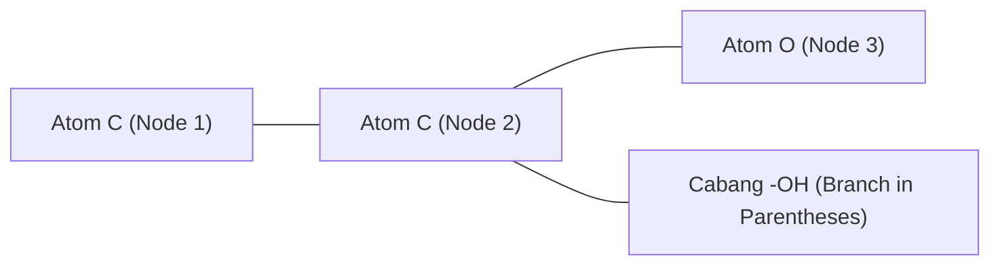

# How Computers See Molecules: From 3D Graph to 1D SMILES

> **One-Sentence Core Idea:**  
> Komputer melihat molekul kimia bukan sebagai gambar visual, melainkan sebagai **Undirected Mathematical Graph** di mana atom adalah *Nodes* dan ikatan kimia adalah *Edges*, yang kemudian di-flatten menjadi string 1D (SMILES) menggunakan depth-first traversal.

---

## 1. Masalah Fundamental & Batasan
- Molekul di dunia nyata adalah objek 3D kuantum yang fleksibel.
- Namun database komputer membutuhkan format penyimpanan yang **ringan, searchable, dan deterministik**.
- **Tantangan**: Bagaimana merepresentasikan molekul bercabang (seperti Isobutana) dan molekul cincin (seperti Benzena) ke dalam 1 baris teks ASCII tanpa kehilangan informasi konektivitas atom?

---

## 2. Hipotesis & Mental Model Saya (Feynman Formulation)

### 🍳 Analogi Dunia Nyata:
- **Atom = Stasiun Kereta**, **Ikatan = Rel Kereta**.
- **Cabang `( )` = Rel Percabangan**: Kereta masuk ke jalur cabang sebentar, lalu kembali ke stasiun utama untuk melanjutkan perjalanan.
- **Cincin `1...1` = Portal Teleportasi**: Memberi nomor yang sama pada atom awal dan atom akhir menandakan bahwa kedua atom tersebut saling terikat membentuk loop tertutup.

---

## 3. Pembuktian di Lab
Eksperimen di `labs/cheminformatics/01_reinventing_smiles_parser/lab.py` membuktikan bahwa:
- String `"CC(O)C"` (Isopropanol) bisa di-parse menjadi adjacency list graph secara rekursif.
- String `"c1ccccc1"` (Benzena) membutuhkan tracking indeks ring-closure.

---

## 4. Jebakan & Edge Cases
1. **Aromatisitas**: Karakter huruf kecil (`c`, `n`, `o`) menandakan sistem cincin terkonjugasi (hückel 4n+2), bukan sekadar ikatan tunggal biasa.
2. **Kekule vs Aromatic Form**: `C1=CC=CC=C1` vs `c1ccccc1` mewakili struktur yang sama tetapi representasi grafnya bisa berbeda jika parser tidak melakukan *kekulization*.

---

## 5. Catatan Review Mentor & Sparring Notes
- [x] **Review Mentor**: Analogi rel kereta dan portal loop sangat akurat untuk menggambarkan traversal DFS (Depth-First Search) pada string SMILES.
- [x] **Falsifikasi**: Bagaimana jika ada molekul bisiklik dengan 2 cincin bertumpuk seperti Decalin?
  - *Catatan Jawaban*: SMILES menggunakan nomor berbeda untuk tiap loop (misal `C1CCCC2C1CCCC2`).
- [ ] **Koneksi Konsep Terkait**: [[molecular-descriptors-and-qsar]] *(Downstream: pemanfaatan representasi graf untuk QSAR & ML)*, [[molecular-fingerprints]], [[rdkit-graph-traversal]]
