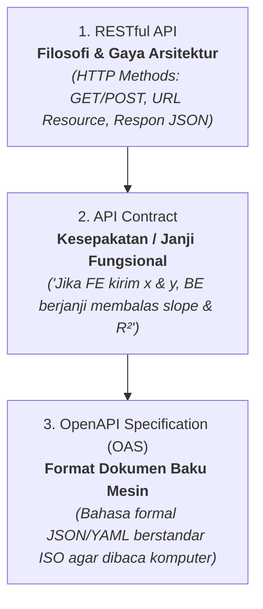

# 📜 OpenAPI Specification, API Contract, dan Design-First Architecture

> **Intisari Mental Model:**  
> Kodingan full-stack yang rapuh berawal dari *asumsi bisik-bisik*: Frontend menebak-nebak nama field yang dikirim Backend, dan Backend mengubah respon JSON tanpa memberi tahu Frontend.  
> Sebaliknya, sistem *production-grade* dibangun di atas **API Contract Tertulis Berstandar OpenAPI** menggunakan pendekatan **Design-First**, yang berfungsi sebagai cetak biru resmi yang dapat dibaca manusia dan dieksekusi mesin (*machine-readable*).

---

## 1. Hubungan Trinitas: RESTful API vs API Contract vs OpenAPI

Untuk memahami OpenAPI, kita harus membedakan tiga konsep yang sering tertukar:



| Dimensi | RESTful API | API Contract | OpenAPI Specification (OAS) |
| :--- | :--- | :--- | :--- |
| **Hakikat** | Gaya arsitektur (*Architectural Style*) | Perjanjian antarmuka (*The Agreement*) | Dokumen baku mesin (*The Standardized Schema*) |
| **Bentuk** | Pola pikir: Resource, Stateless, HTTP Verbs | Dokumen tertulis / janji tim | File formal `.yaml` atau `.json` (dulu bernama Swagger) |
| **Audiens** | Engineer / Konseptor | Developer Frontend & Backend | **Parser Komputer**, Validator, Generator Tipe, & AI |
| **Tujuan** | Standar komunikasi web | Mencegah miskomunikasi | Otomatisasi type-safety, mock data, dan dokumentasi interaktif |

---

## 2. Mengapa Memilih "Design-First" (Kontrak Dulu Baru Koding)?

Terdapat dua metodologi saat membangun sistem API:

```
[ Pendekatan A: Code-First ]
Coding Backend (Express/Python) ──► Generate OpenAPI belakangan ──► Frontend baru bisa menyesuaikan
❌ Frontend harus menunggu Backend selesai koding.
❌ Rawan silent breaking changes di payload respon JSON.

[ Pendekatan B: Design-First (Pilihan Valid-Ex) ]
Rancang openapi.yaml bersama ──► Kunci Kontrak (SSOT) ──► Frontend & Backend koding PARALEL bersamaan!
✅ Frontend membuat mock data langsung dari kontrak.
✅ Backend fokus memenuhi skema kontrak secara deterministik.
✅ AI Agent memiliki batas konteks yang sangat jelas dan tidak berhalusinasi.
```

---

## 3. Empat Kekuatan Super OpenAPI (Machine-Readable Power)

Mengapa menulis kontrak dalam format OpenAPI jauh lebih unggul daripada sekadar catatan Markdown biasa?

### A. End-to-End Type Safety (TypeScript Code Generation)
Dari file `openapi.yaml`, CLI generator dapat secara instan membuatkan deklarasi tipe TypeScript untuk Frontend React:
```bash
npx openapi-typescript openapi.yaml -o frontend/src/types/api.ts
```
Jika Backend mengubah nama kolom (misal `final_concentration` menjadi `finalConc`), TypeScript di Frontend **seketika mengeluarkan compile error merah**. Kesalahan tertangkap di IDE, bukan di browser pengguna saat produksi!

### B. Dokumentasi Interaktif Otomatis (Swagger UI)
Hanya dengan menambahkan satu baris middleware di Express (`swagger-ui-express`), server otomatis menyajikan dashboard interaktif di `/docs`. Developer atau auditor ISO 17025 dapat mencoba mengirim data langsung dari browser (*live testing*) tanpa bantuan Postman.

### C. Validasi Request Otomatis di Gateway
Middleware seperti `express-openapi-validator` membaca spesifikasi OpenAPI dan otomatis memvalidasi setiap payload masuk. Jika ada analis yang mengirim string ke kolom numerik, gateway langsung menolak dengan `400 Bad Request` tanpa perlu menulis lusinan baris `if (!req.body.x)` manual.

### D. Interoperabilitas Python (FastAPI Native Support)
Framework modern Python seperti **FastAPI** dibangun langsung di atas standar OpenAPI. Model Pydantic di Python dapat mengekspor dan mengonsumsi skema OpenAPI secara langsung, menjamin komputasi SciPy selaras dengan Express.

---

## 4. Anatomi File OpenAPI (YAML) untuk Kasus `valid-ex`

```yaml
openapi: 3.0.3
info:
  title: Valid-Ex Calibration & Quant Engine API
  version: 1.0.0
  description: API untuk validasi metode spektrometri dan evaluasi kalibrasi ISO/IEC 17025.

paths:
  /api/v1/calibrations/ols:
    post:
      summary: Hitung regresi OLS dan limit deteksi IUPAC/EURACHEM
      requestBody:
        required: true
        content:
          application/json:
            schema:
              $ref: '#/components/schemas/CalibrationRequest'
      responses:
        '200':
          description: Kalkulasi berhasil
          content:
            application/json:
              schema:
                $ref: '#/components/schemas/CalibrationResponse'
        '400':
          description: Input titik standar tidak valid (< 3 titik atau varians nol)

components:
  schemas:
    CalibrationPoint:
      type: object
      required: [x, y]
      properties:
        x:
          type: number
          description: Konsentrasi nominal larutan standar (ppb)
          example: 50.0
        y:
          type: number
          description: Sinyal respon instrumen (cps atau Area)
          example: 1850796.42

    CalibrationRequest:
      type: object
      required: [analyte, points]
      properties:
        analyte:
          type: string
          example: "27Al (KED)"
        points:
          type: array
          minItems: 3
          items:
            $ref: '#/components/schemas/CalibrationPoint'

    CalibrationResponse:
      type: object
      required: [slope, intercept, r_squared, r_pearson, lod_instrument, loq_instrument, is_linear]
      properties:
        slope: { type: number, example: 34210.5 }
        intercept: { type: number, example: 120.4 }
        r_squared: { type: number, example: 0.9998 }
        r_pearson: { type: number, example: 0.9999 }
        lod_instrument: { type: number, description: "3 * syx / slope", example: 0.035 }
        loq_instrument: { type: number, description: "10 * syx / slope", example: 0.116 }
        is_linear: { type: boolean, description: "r >= 0.995", example: true }
```

---

## 5. OpenAPI dalam Arsitektur Monorepo vs Polyrepo

Untuk proyek seperti `valid-ex` yang dikerjakan bersama **Agentic AI**:

| Parameter | Monorepo (Satu Repository) | Polyrepo (Repo FE & BE Terpisah) |
| :--- | :--- | :--- |
| **Struktur** | `packages/frontend`, `packages/gateway`, `packages/science-engine` dalam 1 git. | Repo `valid-ex-web` terpisah dari `valid-ex-api`. |
| **Kolaborasi dengan AI** | 🟢 **Sangat Kuat**: AI Agent dapat membaca skema Drizzle, OpenAPI, dan komponen React secara bersamaan dalam satu konteks workspace. | 🔴 **Terfragmentasi**: AI kehilangan konteks saat berpindah repo; rawan terjadi desinkronisasi kontrak. |
| **Distribusi Kontrak** | File `contracts/openapi.yaml` berada di root; script build langsung men-generate types ke Frontend dan Backend sekaligus. | Harus menggunakan package manager registry (npm private) atau git submodule rumit. |

> **Rekomendasi Arsitektur Valid-Ex**:  
> Gunakan **Monorepo** dengan file `contracts/openapi.yaml` di root sebagai jangkar kebenaran (*Single Source of Truth*).

---

## 🔗 Tautan Terkait
- Menegakkan batas sistem: [[spec-invariants-dan-ai-alignment]]
- Anatomi software production-grade: [[production-grade-anatomy]]
- Skema database dan relasi: [[Database Migrations]]
