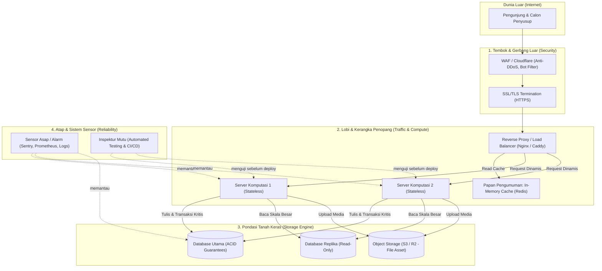

# 🏛️ Anatomi Website Production-Grade: Dari Pondasi hingga Interior

> **Intisari Mental Model:**  
> Aplikasi mainan (*toy project* / `localhost`) sering kali hanya sibuk menghias "interior" (UI/UX dan tombol CRUD).  
> Sebaliknya, sistem **production-grade** dirancang dari bawah ke atas agar **tidak runtuh saat diterpa gempa (server crash), badai (traffic spike), atau disatroni maling (cyber attack)**.

---

## 🗺️ Peta Perbandingan: Rumah vs Software



---

## 🧱 1. Pondasi (The Bedrock): Database & Data Persistence

Pondasi adalah tempat bertumpunya seluruh bobot bangunan. Server komputasi boleh hancur ratusan kali, namun jika data hilang atau korup, sistem tamat seketika.

### Prinsip Utama: [[acid-transactions]]
- **Atomicity (*All or Nothing*)**: Semua langkah dalam satu transaksi harus berhasil bersamaan. Jika ada satu langkah gagal (misal: saldo terpotong tapi penerima belum dapat), sistem otomatis melakukan **rollback**.
- **Consistency (*Hukum Rumah Tangga*)**: Data hanya boleh berpindah dari kondisi valid ke kondisi valid berikutnya (menegakkan aturan unik, *foreign key*, `saldo >= 0`).
- **Isolation (*Anti Balapan / Race Conditions*)**: Dua transaksi bersamaan (misal berebut 1 tiket konser terakhir) diisolasi menggunakan mekanisme *Locking* (`SELECT ... FOR UPDATE`) atau *Optimistic Concurrency Control* agar tidak terjadi *overselling*.
- **Durability (*Abadi*)**: Sekali data dinyatakan berhasil disimpan (*committed*), data tersebut terukir di disk fisik non-volatile (via *Write-Ahead Logging* / WAL) dan tidak lenyap meski listrik data center padam 1 mikrodetik kemudian.

### Praktik Production:
- Pemisahan data persisten (Database) vs data aset besar (Object Storage seperti AWS S3 / Cloudflare R2).
- Replikasi Database: 1 Primary (Write) + N Replica (Read) dengan *Automated Daily Backup* & uji coba *restore*.

---

## 🏗️ 2. Kerangka Besi & Penyalur Beban (Structural Frame)

Menyalurkan beban jutaan tamu agar tidak langsung menghantam dan meremukkan pondasi.

### A. Stateless Compute Engine
- **Prinsip**: *"Server adalah kalkulator amnesia, bukan brankas."*
- Server aplikasi (Node.js/Go/Python) **dilarang menyimpan status/state lokal** di memori (`const users = []`) atau menyimpan file unggahan di harddisk lokal.
- Semua state ditaruh di Database, Redis, atau Token JWT/Session terpusat.
- **Dampaknya**: Server bisa digandakan (*scale horizontally*) dari 1 menjadi 10 kontainer dalam sekejap, dan dimatikan tanpa kehilangan data.

### B. Load Balancer & Reverse Proxy
- Berdiri di gerbang depan (`Nginx`, `Caddy`, atau Cloud Load Balancer).
- Mengatur *traffic routing* ke server-server aplikasi yang sehat (*health check*).
- Memungkinkan **Zero-Downtime Deployment**: Mengalihkan lalu lintas ke Server B saat Server A sedang diperbarui kodenya.

### C. Caching Strategy (Redis & CDN)
- Memisahkan beban **Read (99%)** dari **Write (1%)**.
- Data yang sering dibaca dan jarang berubah (jadwal, profil publik, katalog produk) ditaruh di RAM (Redis / Edge CDN) sehingga pengunjung mendapat respons dalam hitungan milidetik tanpa menyentuh database.

---

## 🛡️ 3. Tembok Luar & Pos Satpam: [[defense-in-depth]]

Pertahanan tidak boleh bergantung hanya pada satu titik (misalnya cuma validasi di form frontend).

| Pos Satpam | Ancaman yang Dicegah | Solusi Teknis |
| :--- | :--- | :--- |
| **Kabel Internet (In-Transit)** | Penyadapan data di WiFi publik (*Man-in-the-Middle*) | **HTTPS / TLS Encryption** (SSL gratis via Let's Encrypt / Cloudflare). |
| **Saku Tamu (Client Browser)** | Pencurian token login via skrip jahat (*XSS - Cross Site Scripting*) | Simpan sesi di **`httpOnly`, `Secure`, `SameSite=Strict` Cookies** (bukan di `localStorage`). |
| **Pintu Masuk (Perimeter)** | Serbuan robot dan serangan DDoS | **Rate Limiting** (batasi misal maks 5 login per menit per IP) + Cloudflare WAF. |
| **Meja Kasir (Data Boundary)** | Manipulasi perintah database (*SQL Injection*) | **Parameterized Queries / Prepared Statements** (ORMs / Query Builders seperti Drizzle, Prisma, sqlx). Memisahkan mutlak antara *Kode SQL* dan *Data Pengguna*. |

---

## 🚨 4. Sistem Alarm & Mandor: Reliability & Quality

Rumah mewah tidak layak huni tanpa instalasi sensor darurat dan pemeriksaan standar konstruksi.

### A. Observability (Sistem Alarm Kebakaran)
- **Centralized Logging**: Mencatat kejadian penting tanpa mengekspos data sensitif (password/token).
- **Error Tracking**: Menggunakan alat seperti `Sentry` atau `Highlight` agar saat ada *Error 500* di produksi, engineer langsung mendapat notifikasi lengkap dengan baris kodenya sebelum ada pengguna yang komplain.
- **Health Checks**: Endpoint `/healthz` yang secara rutin diping untuk memastikan server dan koneksi database masih hidup.

### B. Automated Testing & CI/CD (Inspektur Bangunan)
- **Unit & Integration Tests**: Rangkaian tes otomatis yang menguji logika transaksi dan auth sebelum kode diizinkan masuk ke server produksi.
- **CI/CD Pipeline (GitHub Actions)**: Robot otomatis yang menjalankan pengujian (*linting*, *typecheck*, *test suite*) dan merilis kontainer baru secara otomatis saat *push* ke cabang `main`.

---

## 📋 Contekan Solo-Developer: Blueprint "Monorepo + Docker"

Untuk pengembang solo atau tim kecil, arsitektur paling efisien dan tangguh tanpa biaya tinggi adalah:

```text
my-project/
├── apps/
│   ├── web/                 <-- Frontend (Next.js / Vite React)
│   └── api/                 <-- Backend (Fastify / Express / Go)
│       └── Dockerfile       <-- Kontainer komputasi backend
├── packages/
│   └── types/               <-- Shared TypeScript Interfaces (Contract)
├── docker-compose.yml       <-- Mengorkestrasi: API + Postgres + Redis + Caddy
└── .github/workflows/ci.yml <-- Otomasi pengujian saat git push
```

### Panduan Memilih Jalur Hosting:

1. **Jalur Cepat (PaaS / Vercel + Supabase/Neon)**:
   - Sangat cocok untuk validasi ide & MVP kilat.
   - Frontend di-hosting di Vercel, Database di penyedia Serverless Postgres.
   - *Kelemahan*: Biaya bisa melonjak eksponensial jika traffic/database query meledak (*cold start* & *bandwidth costs*).

2. **Jalur Mandiri (Self-Hosted: VPS + Docker + Coolify / Kamal)**:
   - Menyewa VPS Linux ($4–$10/bulan di Hetzner / DigitalOcean).
   - Seluruh ekosistem (API, Redis, Postgres, Nginx/Caddy) berjalan di Docker.
   - *Kelebihan*: Biaya tetap datar (*predictable cost*), kontrol penuh, pemahaman mendalam atas infrastruktur sendiri.

---

## 🔗 Catatan Terkait
- [[acid-transactions]] — Bedah mendalam isolasi transaksi dan locking.
- [[defense-in-depth]] — Checklist keamanan aplikasi web modern.
- [[docker-compose-production]] — Template produksi docker-compose dengan Caddy dan PostgreSQL.
- [[Database Migrations]] — Prosedur evolusi skema database tanpa downtime (Expand & Contract).