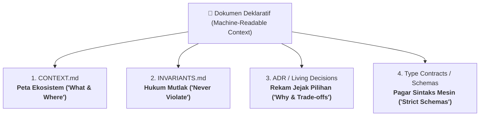

# 🛡️ Framework Spec & Invariants, Red Team Testing, dan AI Alignment

> **Intisari Mental Model:**  
> Kodingan yang rapuh berawal dari *vibe coding*: langsung melompat membuat kode berdasarkan skenario ideal (*happy path*).  
> Sebaliknya, software berstandar *production-grade* dibangun dengan meletakkan **Spec & Invariant** di awal, mengikat AI dengan **Dokumen Deklaratif**, dan menguji keandalannya menggunakan **Pola Pikir Red Team (Hukum Murphy)**.

---

## 1. Spec vs Invariant: Membedakan Janji Fitur dan Batas Integritas

| Dimensi | Specification (Spec) | Invariant |
| :--- | :--- | :--- |
| **Definisi** | **Apa yang dijanjikan** (*Functional Contract*) | **Kebenaran yang haram dilanggar** (*Systemic Integrity Boundary*) |
| **Pertanyaan Kunci** | *"Fitur ini menerima apa dan menghasilkan apa?"* | *"Kondisi apa yang wajib selalu bernilai `TRUE` meski dunia kiamat?"* |
| **Sumber** | Kebutuhan stakeholder, user story, UI wireframe | Hukum fisika alam, regulasi metrologi/audit, batasan memori OS |
| **Contoh (Lab)** | Menerima data CPS deret standar dan menghitung konsentrasi sampel dalam ppm. | Nilai konsentrasi tidak boleh negatif ($C \ge 0$), titik kalibrasi $N \ge 6$, konsentrasi harus bertingkat/monoton naik. |
| **Jika Dilanggar** | Fitur dianggap belum selesai (*incomplete*). | Sistem korup, database rusak, atau server crash (*system collapse*). |

### 3 Lapis Penjaga Invariant:
1. **Type / Schema Layer (Compile-time)**: Tipe data ketat (*Branded Types* TypeScript, *Pydantic*) mencegah input liar sebelum kode dieksekusi.
2. **Runtime Assertion / DB Constraints (Execution-time)**: Validasi di domain logic atau constraint database (misal: `CHECK (concentration >= 0)`).
3. **Automated Testing (Verification-time)**: Pengujian otomatis (TDD) yang secara agresif mencoba membobol aturan batas tersebut.

---

## 2. Empat Pilar Dokumen Deklaratif (Machine-Readable Context)

Mengapa memberi instruksi panjang di chat sering gagal?
Karena chat bersifat sementara (*ephemeral*), token tergeser, dan AI mengalami **attention drift** serta bias optimis (*happy-path bias*). 

Dokumen deklaratif berfungsi sebagai **"Konstitusi Tertulis"** yang menjadi *Single Source of Truth (SSOT)*:



1. **`CONTEXT.md` (Peta Ekosistem - *What & Where*)**:
   - Berisi gambaran arsitektur sistem, tech stack yang dipakai, dan milestone aktif.
   - *Fungsi ke AI*: Mencegah AI menyarankan stack yang tidak sesuai (misal: mengusulkan Mongo padahal proyek memakai PostgreSQL + Drizzle).
2. **`INVARIANTS.md` (Hukum Mutlak - *Never Violate*)**:
   - Berisi aturan logika domain dan komputasi yang tidak boleh dilanggar.
   - *Fungsi ke AI*: Berfungsi sebagai rem tangan dan batasan desain.
3. **`ADR/` (Architecture Decision Records - *Why & Trade-offs*)**:
   - Rekam jejak keputusan ketika menemui persimpangan jalan arsitektur.
   - *Fungsi ke AI*: Mencegah *circular refactoring* (AI menyarankan kembali solusi yang sudah pernah ditolak).
4. **`Type Contracts / Schemas` (`schema.ts`, `models.py`)**:
   - Skema data dan kontrak interface yang disepakati.
   - *Fungsi ke AI*: Pagar mesin; type checker langsung menggagalkan kode yang menyimpang dari kontrak.

> **Timeline Pembuatan**:
> `CONTEXT.md`, `INVARIANTS.md`, dan `Type Contracts` dibuat **di awal sebelum coding dimulai** (*Spec & Invariant First*). Sedangkan `ADR` diisi **secara bertahap** setiap kali tim mengambil keputusan arsitektur penting.

---

## 3. Memahami ADR: Rekam Jejak Arsitektur vs Log Harian

ADR bukan buku harian atau catatan commit harian. ADR hanya dibuat ketika ada **persimpangan jalan arsitektur** yang memiliki konsekuensi teknis dan trade-off.

### Anatomi File ADR
```markdown
# ADR-001: Judul Keputusan yang Diambil

## Status
Accepted / Rejected / Deprecated

## Context (Masalah yang Dihadapi)
Penjelasan masalah teknis, kendala bisnis, atau regulasi yang melatarbelakangi keputusan.

## Decision (Pilihan yang Diambil)
Solusi spesifik yang kita sepakati untuk diterapkan.

## Consequences (Trade-offs / Konsekuensi)
- Positif (+): Keuntungan utama dari solusi ini.
- Negatif (-): Beban komputasi, kompleksitas, atau batasan yang rela kita tanggung.
```

---

## 4. Pola Pikir Red Team: Menguji Hukum Murphy di Web Traffic

Pengujian unit/integrasi bukan untuk "membuktikan kode berjalan benar", melainkan **"mencari cara membunuh kode sebelum pengguna/hacker melakukannya"**.

### 4 Vektor Kekacauan Web:
1. **Input / Boundary Chaos (Data Racun)**:
   - Pengguna mengirim string raksasa, array kosong, karakter aneh, atau angka negatif.
   - *Uji*: Validasi skema, sanitasi input, dan penanganan nilai batas (*edge cases*).
2. **Concurrency & Race Condition (Balapan Waktu)**:
   - Dua request tiba di milidetik yang sama (misal *double-click* tombol simpan).
   - *Uji*: Idempotency key, database unique index, locking transaction.
3. **Network Fault & Aborted Request (Koneksi Putus)**:
   - Wi-Fi mati atau browser ditutup saat upload file 50 MB baru berjalan separuh.
   - *Uji*: Penanganan koneksi terputus agar tidak menyisakan file korup di storage.
4. **Resource Exhaustion (Layer -1 RAM & Layer -2 OS)**:
   - Mengunggah file besar langsung ke memori V8 Node.js (`in-memory buffer`) menyebabkan lonjakan RAM hingga memicu Linux OOM Killer.
   - *Uji*: Streaming chunks, batas maksimum payload (`413 Payload Too Large`), dan pemantauan delta memori.

---

## 5. Strategi Pertahanan Berlapis (Defense in Depth)

Ketika merancang penanganan kegagalan (misalnya pembersihan file sementara upload), gunakan prinsip pertahanan berlapis:

```
[Garis Pertahanan 1: Real-time Event]
req.on('aborted') / req.on('close') 
  └─> Hapus file sampah di disk detik itu juga.

[Garis Pertahanan 2: Safety Net Cron Reaper]
Cron Job TTL (Background Worker) 
  └─> Hapus file sementara dengan usia > 2 jam jika server sempat crash / mati lampu mendadak.
```

---

## 6. Alur Kolaborasi Driver-Navigator dengan AI

```
[Otak Kamu (Driver)] 
  1. Rumuskan Domain Invariants & Physical Constraints
         ↓
[Dokumen Deklaratif] 
  2. Catat di CONTEXT.md, INVARIANTS.md, dan Type Schemas
         ↓
[AI (Red Team / Navigator)] 
  3. AI menantang desain dengan skenario chaos & membuat Failing Tests (RED)
         ↓
[Implementasi Kode] 
  4. Tulis logika komputasi hingga tes lulus (GREEN) & catat keputusan di ADR
```
