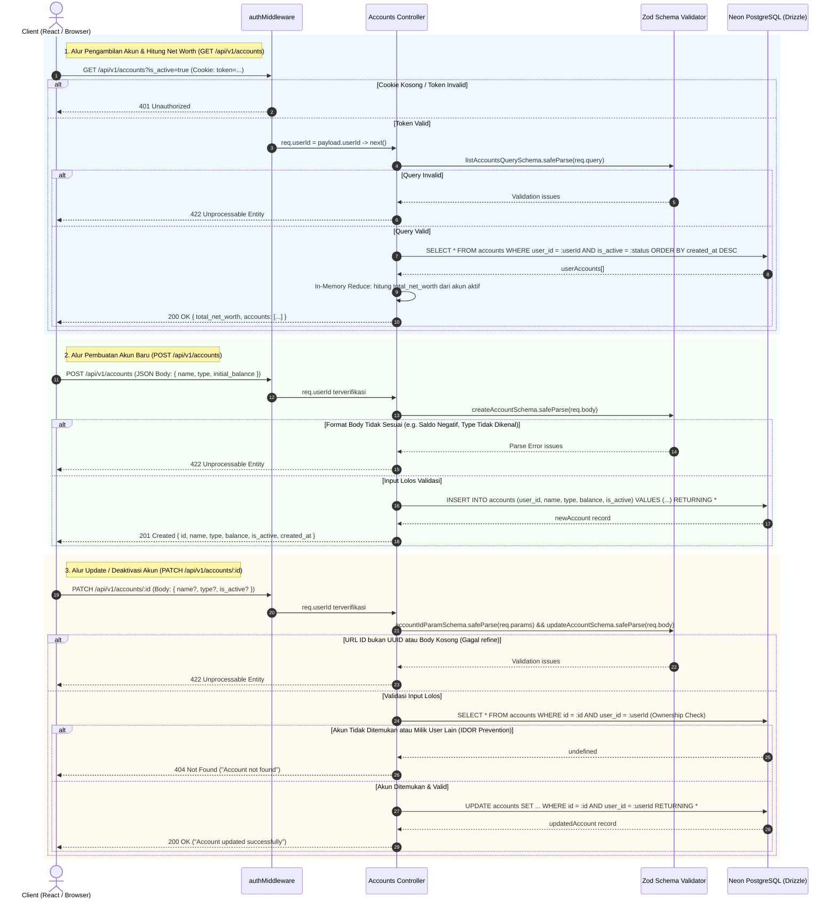

# 💳 Backend Accounts (BE-Accounts) — Deep Architecture & Mental Model

Dokumentasi ini menyajikan dekonstruksi mendalam arsitektur fitur **Accounts (Manajemen Akun & Saldo Keuangan)** pada `projects/expense-tracker/apps/server/src/features/accounts`, `db/schema.ts`, dan integrasinya dengan lapisan middleware autentikasi.

Dokumentasi ini dirancang menggunakan pendekatan ***First-Principles & Submarine Method***: tidak sekadar merangkum kode secara pasif, melainkan membedah alasan desain, mekanika komputasi runtime, batasan protokol & database, serta **Falsification Lab** berisi skenario kegagalan nyata untuk menguji daya analisis teknismu.

---

## 🧭 Peta Alur Arsitektur (End-to-End Flow)

Fitur Accounts mencakup tiga operasi fundamental:
1. **Daftar Akun & Agregasi Kekayaan Bersih (`GET /api/v1/accounts`)**
2. **Pembuatan Akun Baru (`POST /api/v1/accounts`)**
3. **Pembaruan / Deaktivasi Akun (`PATCH /api/v1/accounts/:id`)**

Seluruh operasi ini diproteksi oleh lapisan autentikasi (`authMiddleware`) yang mewajibkan validasi JWT via HTTP-Only Cookie.



---

## 🔬 Dekonstruksi Submarine (The 3 Layers)

Untuk memahami kode melampaui sintaks permukaan, kita membedah arsitektur Accounts ke dalam 3 lapisan realitas komputasi:

```text
┌────────────────────────────────────────────────────────┐
│ Layer  0: Express Router, Zod Refine, Drizzle Query    │ (Surface Code)
├────────────────────────────────────────────────────────┤
│ Layer -1: IEEE-754 Safe Integer, In-Memory Aggregation │ (Runtime & CS)
├────────────────────────────────────────────────────────┤
│ Layer -2: HTTP REST Semantics, B-Tree, FK RESTRICT     │ (Protocol & DB)
└────────────────────────────────────────────────────────┘
```

### 1. Layer 0: Surface & Framework APIs
* **Router-Level Guard (`router.use(authMiddleware)`)**:
  Alih-alih menyematkan `authMiddleware` pada masing-masing handler (`router.get('/', authMiddleware, ...)`, `router.post('/', authMiddleware, ...)`), seluruh router akun dibungkus di level paling atas. Pendekatan ini menerapkan prinsip *Secure by Default* (fail-close): rute baru yang ditambahkan di masa depan secara otomatis terproteksi tanpa risiko kelupaan menyertakan middleware pengaman.
* **Schema Validation & Compound Refinement (`updateAccountSchema.refine`)**:
  Zod digunakan tidak hanya untuk memeriksa tipe data primitif, tetapi juga aturan relasional antar field. Klausa `.refine((data) => data.name !== undefined || data.type !== undefined || data.is_active !== undefined)` menolak request PATCH yang mengirimkan body kosong `{}` dengan HTTP 422, mencegah query `UPDATE accounts SET WHERE ...` tanpa kolom perubahan yang membuang I/O database.
* **Type-Safe Dynamic SQL Conditions**:
  Controller mengumpulkan kondisi filter dalam array `conditions = [eq(accounts.user_id, userId)]` dan menyusun klausa SQL secara dinamis lewat `and(...conditions)`. Ini menghasilkan prepared statement terkompilasi yang type-safe tanpa string concatenation manual yang rawan SQL Injection.

### 2. Layer -1: Runtime & Mekanika Komputasi (Node.js & V8 Engine)
* **PostgreSQL `BIGINT` vs JavaScript Number (IEEE-754 Float64 Limit)**:
  * Di PostgreSQL, tipe data `balance` didefinisikan sebagai `BIGINT` (signed 64-bit integer dengan rentang $-2^{63}$ hingga $2^{63}-1 \approx \pm 9.22 \times 10^{18}$).
  * Di Node.js/V8, semua angka default bertipe `number` yang merupakan representasi floating-point 64-bit berstandar **IEEE-754**. Batas angka bulat yang dapat direpresentasikan secara presisi tanpa kehilangan ketepatan matematis (*exact integer*) adalah `Number.MAX_SAFE_INTEGER` ($2^{53} - 1 = 9.007.199.254.740.991$ atau ~9 Kuadriliun Rupiah).
  * Konfigurasi Drizzle `bigint('balance', { mode: 'number' })` mengonversi nilai database menjadi JavaScript `number`.
    > [!NOTE]
    > Mengapa `{ mode: 'number' }` dipilih daripada native JavaScript `BigInt`? Karena objek native `BigInt` (misal: `100000n`) **tidak dapat diserialisasi secara native oleh `JSON.stringify()`** (akan melempar `TypeError: Do not know how to serialize a BigInt`). Selama perputaran uang di aplikasi tidak melampaui 9 kuadriliun Rupiah, mode `number` memberikan trade-off terbaik antara kepraktisan serialisasi JSON dan presisi nilai.
* **In-Memory Net Worth Calculation vs V8 Heap**:
  * Perhitungan `total_net_worth` di `getAccounts` dieksekusi di Node.js runtime menggunakan `.filter().reduce()`:
    ```typescript
    const total_net_worth = userAccounts
      .filter((acc) => acc.is_active)
      .reduce((sum, acc) => sum + Number(acc.balance), 0);
    ```
  * Seluruh baris akun dialokasikan ke dalam memori V8 Heap sebagai array objek sebelum dilakukan kalkulasi secara sekuensial. Untuk skala akun personal (5–20 akun per pengguna), overhead memori dan CPU berorde $O(N)$ ini dapat diabaikan ($\ll 1\text{ ms}$).

### 3. Layer -2: Protokol Jaringan, REST Semantics & Storage Engine
* **HTTP Semantics: `PATCH` vs `PUT`**:
  * Endpoint update menggunakan kata kerja `PATCH` (RFC 5789), bukan `PUT` (RFC 7231).
  * `PUT` secara semantik menuntut *full replacement* dari entitas target (klien wajib mengirimkan seluruh representasi entitas).
  * `PATCH` merepresentasikan *partial modification* (hanya field yang ingin diubah yang dikirimkan). Dalam konteks akun, pengguna dapat mengganti nama saja tanpa harus menyuplai kembali tipe atau status aktifnya.
* **B-Tree Indexing (`idx_accounts_user_id`)**:
  * Di level storage engine PostgreSQL, tabel `accounts` dilengkapi indeks B-Tree:
    ```sql
    CREATE INDEX idx_accounts_user_id ON accounts(user_id);
    ```
  * Setiap query `WHERE user_id = $1` tidak perlu melakukan *Sequential Scan* ($O(N)$ pembacaan disk blok per blok). PostgreSQL Planner menggunakan indeks B-Tree ($O(\log N)$ pembacaan root-ke-leaf) untuk langsung melompat ke pointer tuple data milik pengguna yang bersangkutan.
* **Integritas Relasional & Ledgers (`ON DELETE RESTRICT`)**:
  * Pada skema database `schema.sql`, perhatikan bagaimana tabel `transactions` mereferensikan tabel `accounts`:
    ```sql
    account_id UUID NOT NULL REFERENCES accounts(id) ON DELETE RESTRICT
    ```
  * Ini adalah batasan struktural paling penting: **Akun yang sudah memiliki catatan transaksi historis dilarang keras dihapus secara fisik (*Hard Delete*) dari disk**. Jika dihapus, relasi transaksi akan menjadi *orphaned record* atau melanggar *foreign key constraint*. Inilah landasan mutlak mengapa fitur Accounts mengimplementasikan mekanisme *Soft Deactivation* (`is_active: false`) via `PATCH /:id`.

---

## 📂 Bedah File & Tanggung Jawab Desain

Berikut adalah anatomi file-file penyusun fitur `accounts`:

```text
apps/server/src/features/accounts/
├── accounts.routes.ts       # HTTP Route Definitions & Middleware Chaining
├── accounts.schema.ts       # Zod Contracts, Runtime Parsing & DTO Inferences
└── accounts.controller.ts   # Request Handlers, Drizzle Querying & Net Worth Engine
```

---

### 1. `accounts.routes.ts` (Gerbang Masuk Rute & Proteksi)

```typescript
import { Router } from 'express';
import { authMiddleware } from '../../middlewares/auth.middleware.js';
import { getAccounts, createAccount, updateAccount } from './accounts.controller.js';

const router = Router();

// Semua rute akun wajib terautentikasi (JWT cookie)
router.use(authMiddleware);

router.get('/', getAccounts);
router.post('/', createAccount);
router.patch('/:id', updateAccount);

export default router;
```

* **Single Responsibility**: Mengatur pemetaan URI HTTP terhadap handler fungsi dan menegakkan perimeter keamanan secara global di level router.
* **Design Decision**: Penggunaan `router.use(authMiddleware)` di baris ke-12 memastikan tidak ada satupun rute di bawah `/api/v1/accounts` yang dapat diakses tanpa sesi login yang valid.

---

### 2. `accounts.schema.ts` (Kontrak Runtime & Validasi Fail-Fast)

File ini bertindak sebagai penjaga gerbang data (*Validation Barrier*) sebelum request menyentuh database atau logika komputasi.

#### A. Skema Pembuatan Akun (`createAccountSchema`)
```typescript
export const createAccountSchema = z.object({
  name: z
    .string()
    .trim()
    .min(1, { message: 'Account name cannot be empty' })
    .max(255, { message: 'Account name cannot exceed 255 characters' }),
  type: z.enum(['tunai', 'bank', 'e-wallet'], {
    message: "Account type must be one of: 'tunai', 'bank', 'e-wallet'",
  }),
  initial_balance: z
    .number({ message: 'Initial balance must be a number' })
    .int({ message: 'Initial balance must be an integer' })
    .min(0, { message: 'Initial balance cannot be negative' })
    .default(0),
});
```
* **Invarian yang Dijaga**:
  * `.trim()`: Mencegah nama akun yang hanya berisi spasi kosong lolos validasi.
  * `initial_balance.int().min(0)`: Saldo awal wajib berupa bilangan bulat non-negatif. Mencegah input saldo minus atau bilangan desimal pecahan.

#### B. Skema Pembaruan Akun (`updateAccountSchema`)
```typescript
export const updateAccountSchema = z
  .object({
    name: z.string().trim().min(1).max(255).optional(),
    type: z.enum(['tunai', 'bank', 'e-wallet']).optional(),
    is_active: z.boolean({ message: 'is_active must be a boolean' }).optional(),
  })
  .refine(
    (data) =>
      data.name !== undefined ||
      data.type !== undefined ||
      data.is_active !== undefined,
    {
      message: 'At least one field (name, type, is_active) must be provided for update',
    }
  );
```
* **Invarian yang Dijaga**:
  * **Ketiadaan Field `balance`**: Perhatikan bahwa `balance` **sengaja tidak ada** di skema ini! Saldo akun tidak boleh diubah secara sewenang-wenang lewat endpoint edit akun, melainkan harus bermutasi melalui pencatatan transaksi ledger.
  * `.refine(...)`: Mencegah pemanggilan kosong (`PATCH {}`) yang memicu eksekusi update redundan di PostgreSQL.

#### C. Skema Parameter & Query String
```typescript
export const accountIdParamSchema = z.object({
  id: z.string().uuid({ message: 'Invalid account ID format (must be UUID)' }),
});

export const listAccountsQuerySchema = z.object({
  is_active: z.enum(['true', 'false', 'all']).optional().default('true'),
});
```
* **Invarian yang Dijaga**:
  * `id`: Wajib UUID v4 valid. Jika klien mengirimkan `PATCH /api/v1/accounts/123-bukan-uuid`, request langsung ditolak dengan HTTP 422 sebelum query database dilempar (menghindari error syntax database Postgres).
  * `is_active`: Karena query string di HTTP selalu bertipe `string`, nilai query dipetakan sebagai string enum `'true' | 'false' | 'all'`, dengan nilai default `'true'`.

---

### 3. `accounts.controller.ts` (Orkestrasi Logika Bisnis & SQL Querying)

Controller bertanggung jawab menghubungkan request dengan database Drizzle dan memformat response seragam.

#### A. Handler `getAccounts`
1. **Ekstraksi Identitas**: Membaca `req.userId` yang diinjeksikan oleh `authMiddleware`.
2. **Validasi Query String**: Memeriksa nilai `is_active`.
3. **Penyusunan Klausa Filter Dinamis**:
   ```typescript
   const conditions = [eq(accounts.user_id, userId)];
   if (is_active === 'true') {
     conditions.push(eq(accounts.is_active, true));
   } else if (is_active === 'false') {
     conditions.push(eq(accounts.is_active, false));
   }
   ```
4. **Query Drizzle**: Mengambil record akun terurut berdasarkan waktu pembuatan terbaru (`orderBy(desc(accounts.created_at))`).
5. **Kalkulasi Net Worth**: Menjumlahkan seluruh saldo akun yang berstatus aktif (`acc.is_active === true`).
6. **Serialisasi DTO**: Memastikan nilai `balance` dikonversi ke tipe JavaScript `number` dan tanggal ke format ISO-8601 string.

#### B. Handler `createAccount`
1. **Validasi Input Body**: Mengeksekusi `createAccountSchema.safeParse(req.body)`. Jika format salah, kembalikan HTTP 422 dengan rincian error per field.
2. **Database Insert**:
   ```typescript
   const [newAccount] = await db
     .insert(accounts)
     .values({
       user_id: userId,
       name,
       type,
       balance: initial_balance,
       is_active: true,
     })
     .returning();
   ```
3. **Response**: Mengembalikan status HTTP 201 Created dengan data akun baru.

#### C. Handler `updateAccount` (Mitigasi IDOR)
1. **Validasi Ganda**: Memvalidasi `req.params` (UUID) dan `req.body` (`refine` minimal 1 field).
2. **Ownership Guard (Pencegahan IDOR)**:
   ```typescript
   const [existingAccount] = await db
     .select()
     .from(accounts)
     .where(and(eq(accounts.id, id), eq(accounts.user_id, userId)));

   if (!existingAccount) {
     return res.status(404).json({
       success: false,
       message: 'Account not found',
     });
   }
   ```
   Query ini memastikan akun yang diupdate **wajib memiliki ID yang cocok DAN dimiliki oleh pengguna yang sedang login**.
3. **Pembaruan Parsial Terpilih**: Menggunakan sintaks *spread operator* kondisional:
   ```typescript
   .set({
     ...(name !== undefined && { name }),
     ...(type !== undefined && { type }),
     ...(is_active !== undefined && { is_active }),
   })
   ```
   Hanya field yang didefinisikan oleh klien yang akan masuk ke klausa `UPDATE accounts SET ...`.

---

## 🧠 Arena Berpikir Kritis (Falsification Lab)

Gunakan skenario pengujian ekstrem (*stress-testing*) berikut untuk menguji pemahaman arsitektur dan menemukan celah tersembunyi pada implementasi saat ini:

---

### 🥊 Tantangan 1: In-Memory Net Worth vs Jebakan Paginasi (The Pagination Trap)
* **Kondisi Kode Saat Ini**:
  Di `getAccounts`, `total_net_worth` dihitung di memori runtime Node.js dari seluruh array akun yang ditarik:
  ```typescript
  const total_net_worth = userAccounts
    .filter((acc) => acc.is_active)
    .reduce((sum, acc) => sum + Number(acc.balance), 0);
  ```
* **Pertanyaan Kritis**:
  *Apa yang akan terjadi jika suatu saat aplikasi menambahkan fitur paginasi (misalnya `LIMIT 10 OFFSET 0` untuk menampung pengguna bisnis yang memiliki 50 rekening)?*
* **Realita Kerusakan Arsitektur**:
  Jika paginasi diterapkan di level query SQL, `userAccounts` hanya akan berisi 10 baris pertama. Akibatnya, fungsi `.reduce()` di Node.js akan menghitung *total net worth* **hanya dari 10 akun di halaman pertama**, bukan seluruh kekayaan pengguna! Nilai net worth yang ditampilkan ke UI menjadi sepenuhnya salah (*corrupted calculation*).
* **Solusi First-Principles (DB Aggregation)**:
  Kekayaan bersih adalah agregat global tingkat akun milik pengguna. Eksekusinya harus didelegasikan langsung ke PostgreSQL menggunakan fungsi agregasi SQL:
  ```typescript
  const [netWorthResult] = await db
    .select({
      total: sql<number>`COALESCE(SUM(${accounts.balance}), 0)`,
    })
    .from(accounts)
    .where(and(eq(accounts.user_id, userId), eq(accounts.is_active, true)));
  ```

---

### 🥊 Tantangan 2: Ketiadaan Constraint Unik pada Nama Akun (Duplicate Accounts & Double Click)
* **Kondisi Kode Saat Ini**:
  Bandingkan tabel `categories` dan tabel `accounts` di `db/schema.ts`:
  * `categories`: memiliki `unique('uq_categories_user_name').on(table.user_id, table.name)`.
  * `accounts`: **TIDAK memiliki** batasan unik pada kombinasi `(user_id, name)`.
* **Pertanyaan Kritis**:
  *Apa dampaknya jika pengguna memiliki koneksi internet lambat lalu melakukan klik ganda (*double click*) pada tombol "Buat Akun"? Atau jika pengguna sengaja membuat 3 akun berbeda dengan nama persis sama: "Dompet Tunai"?*
* **Realita Lapisan Data**:
  Dua request identik akan masuk dan dieksekusi oleh PostgreSQL tanpa ada penolakan. Database akan menghasilkan dua baris akun terpisah dengan ID berbeda namun berlabel identik. Ketika pengguna mencatat transaksi di kemudian hari, antarmuka pemilihan akun akan menampilkan dua pilihan "Dompet Tunai" yang membingungkan tanpa pembeda yang jelas.
* **Pertimbangan Desain**:
  Apakah sebuah sistem keuangan sebaiknya menerapkan constraint unik `(user_id, name)` pada akun?
  * Jika **Ya**: Kita mencegah duplikasi yang tidak disengaja, namun harus menangani PostgreSQL Error code `23505` (*unique_violation*) di controller menjadi HTTP 409 Conflict.
  * Jika **Tidak**: Pengguna bisa membedakannya jika sistem menyediakan kolom tambahan seperti nomor rekening atau institusi bank.

---

### 🥊 Tantangan 3: IDOR (Insecure Direct Object Reference) & Enumeration Information Leak
* **Kondisi Kode Saat Ini**:
  Pada `updateAccount`, ketika akun dengan `id` tertentu tidak ditemukan untuk `userId` yang bersangkutan, server mengembalikan:
  ```typescript
  if (!existingAccount) {
    return res.status(404).json({
      success: false,
      message: 'Account not found',
    });
  }
  ```
* **Pertanyaan Kritis**:
  *Mengapa server mengembalikan `404 Not Found` dan bukan `403 Forbidden` jika ID tersebut sebenarnya ada di database tetapi dimiliki oleh pengguna lain?*
* **Realita Keamanan Jaringan**:
  Jika server mengembalikan `403 Forbidden` saat ID milik orang lain diakses, penyerang dapat melakukan *ID Enumeration/Probing* untuk menebak UUID valid milik pengguna lain. Dengan konsisten mengembalikan `404 Not Found`, server menutup celah kebocoran informasi (*information leakage*): penyerang tidak dapat membedakan apakah UUID tersebut memang tidak pernah ada atau milik pengguna lain.

---

### 🥊 Tantangan 4: Invarian Ledger Finansial: Mengapa Saldo Dikecualikan dari `PATCH`?
* **Kondisi Kode Saat Ini**:
  Di `updateAccountSchema`, field `balance` sengaja tidak disediakan dan tidak dapat diubah oleh pengguna.
* **Pertanyaan Kritis**:
  *Mengapa kita tidak mengizinkan pengguna mengubah saldo akun secara langsung via `PATCH /api/v1/accounts/:id { balance: 10000000 }`? Bukankah itu fitur yang praktis jika saldo di aplikasi tidak cocok dengan saldo fisik dompet?*
* **Realita Akuntansi & Integritas Buku Besar (Audit Trail)**:
  Dalam sistem pencatatan keuangan (*ledger/double-entry accounting*), **saldo adalah turunan (*state derived*) dari akumulasi mutasi transaksi**:
  $$\text{Current Balance} = \text{Initial Balance} + \sum \text{Income} - \sum \text{Expense} \pm \sum \text{Transfers}$$
  Jika pengguna diizinkan melakukan *direct overwrite* pada kolom `balance`:
  1. Integritas buku besar rusak: total mutasi transaksi historis tidak akan lagi cocok dengan angka saldo yang tertera (*Ledger Desynchronization / Drift*).
  2. Jejak audit (*audit trail*) hilang: tidak ada riwayat kapan, mengapa, dan ke mana selisih uang tersebut berpindah.
  Jika terjadi ketidaksesuaian saldo fisik, cara yang benar secara akuntansi adalah membuat transaksi penyesuaian (*Adjustment Transaction / Reconcile Entry*), bukan mengedit kolom saldo akun secara langsung!

---

## 📋 Ringkasan Keputusan Desain (Design Trade-offs)

| Aspek Desain | Pilihan yang Diambil | Alternatif Lain | Alasan / Trade-off |
| :--- | :--- | :--- | :--- |
| **Proteksi Rute** | `router.use(authMiddleware)` di level router | Middleware per-endpoint (`router.get('/', auth, ...)`) | **Pilihan Terpilih**: *Secure-by-default*. Mengeliminasi risiko kelupaan menyematkan guard saat menambahkan endpoint baru ke router akun. |
| **Representasi Uang** | PostgreSQL `BIGINT` + Drizzle `{ mode: 'number' }` | Native JS `BigInt` / String `DECIMAL(15,2)` | Menghindari desimal floating-point IEEE-754 error (`0.1 + 0.2`) tanpa kerumitan serialisasi `JSON.stringify()` pada objek native `BigInt`. Cukup untuk mata uang tanpa pecahan sen hingga 9 kuadriliun Rupiah. |
| **Penghapusan Akun** | Soft Deactivation (`is_active: false`) | Hard Delete (`DELETE FROM accounts`) | Mempertahankan integritas relasional data. Tabel transaksi mengikat `account_id` dengan aturan `ON DELETE RESTRICT`, sehingga baris akun yang memiliki riwayat transaksi dilarang dihapus dari storage. |
| **Hitung Net Worth** | In-Memory `.reduce()` di Node.js | SQL Aggregation `SELECT SUM(balance)` | Sederhana dan bebas round-trip database tambahan untuk dataset akun personal kecil (< 20 akun). Namun rentan menghasilkan angka salah jika sistem paginasi diperkenalkan. |
| **Validasi Update** | Zod `.refine()` untuk minimal 1 field | Mengizinkan body kosong `{}` | Mencegah *empty updates* yang membuang siklus I/O database dan write lock PostgreSQL secara sia-sia. |
| **Pencegahan Akses Data** | Compound Query (`WHERE id = :id AND user_id = :userId`) | Global Query (`WHERE id = :id`) lalu cek manual di JS | Mencegah kerentanan IDOR langsung di level storage query; mengeksekusi pencarian dalam 1 kali evaluasi indeks komposit. |

---

## 💡 Rekomendasi Sintesis Knowledge (Obsidian Second Brain)

Untuk memperdalam pemahaman konsep fundamental yang dipelajari pada modul ini, kamu disarankan mencatat topik berikut ke dalam Obsidian vault di bawah `notes/`:

- `[[webdev/security/idor-prevention]]`: Membahas perbedaan otorisasi berbasis resource ownership vs sekadar token verification.
- `[[database/ledger-integrity-and-soft-deletes]]`: Mengapa sistem finansial mengadopsi event sourcing/ledger dan melarang *hard delete*.
- `[[javascript/runtime/ieee-754-numbers-and-bigint]]`: Memahami batas aman `Number.MAX_SAFE_INTEGER` vs `BigInt` dalam rekayasa perangkat lunak finansial.
