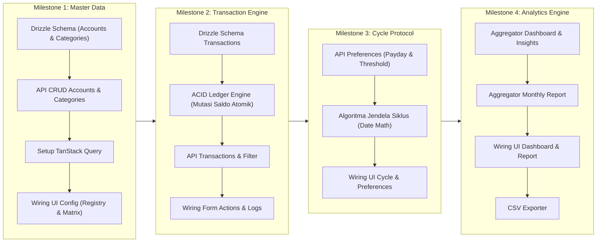

	# 🗺️ Expense Tracker — Milestone & Engineering Backlog

Dokumentasi ini memetakan strategi pengembangan **Expense Tracker** berbasis pendekatan **Vertical Slicing** (fitur end-to-end dari Database $\rightarrow$ API $\rightarrow$ Frontend UI).

---

## 🧭 Visualisasi Alur Ketergantungan (Milestone Flow)

---

## 🏛️ Prinsip Dasar & Keputusan Arsitektur

1. **Vertical Slicing**:
   - Menghindari *half-baked horizontal layers*. Setiap milestone menghasilkan fitur yang selesai dan dapat diverifikasi langsung di antarmuka pengguna.
2. **Causal Dependency Finansial**:
   - `Master Data` (Akun & Kategori) $\rightarrow$ `Ledger Transactions` (Mutasi Saldo) $\rightarrow$ `Cycle Protocol` (Jendela Waktu Gajian) $\rightarrow$ `Analytics Engine` (Agregasi Dashboard/Laporan).
3. **Integritas Angka (`BIGINT`)**:
   - Mata uang Rupiah tidak memerlukan pecahan sen. Penyimpanan dan kalkulasi menggunakan bilangan bulat 64-bit (`BIGINT`) untuk menghindari *floating-point precision drift* (IEEE 754) yang fatal pada sistem akuntansi.
4. **Saldo Awal vs Arus Kas Masuk**:
   - `initial_balance` akun pada Milestone 1 langsung mengisi saldo awal (`balance`) tanpa mengotori tabel transaksi bulanan sebagai *income*, menjaga keaslian riwayat arus kas (*cash flow*).

---

## 📌 Rincian Backlog per Milestone

### 🔹 MILESTONE 1: Master Data Foundation (Accounts & Categories Registry)
*Tujuan: Membangun entitas dasar tempat uang dialokasikan dan diklasifikasikan secara end-to-end.*

- [x] **1.1 Database Layer (Drizzle & Migrations)**
  - [x] Definisikan tabel `accounts` dan `categories` di `apps/server/src/db/schema.ts` mengacu pada `apps/server/src/db/schema.sql`.
  - [x] Setup konfigurasi migrasi Drizzle Kit (`drizzle.config.ts`).
  - [x] Terapkan constraint: `UNIQUE(user_id, name)` untuk kategori, check constraint tipe akun (`tunai`, `bank`, `e-wallet`), dan `limit_amount > 0`.
- [x] **1.2 Backend API: Modul Accounts**
  - [x] Validasi Zod schema untuk request body akun.
  - [x] `GET /api/v1/accounts`: Mengembalikan daftar akun aktif dan kalkulasi `total_net_worth`.
  - [x] `POST /api/v1/accounts`: Membuat akun baru dengan `initial_balance`.
  - [x] `PATCH /api/v1/accounts/:id`: Update nama, tipe, dan *soft-delete* (`is_active: false`).
- [ ] **1.3 Backend API: Modul Categories**
  - [ ] Validasi Zod schema untuk request body kategori.
  - [ ] `GET /api/v1/categories`: Mengambil kategori aktif (filter per tipe `expense` / `income`).
  - [ ] `POST /api/v1/categories`: Tambah kategori baru beserta limit bulanan.
  - [ ] `PATCH /api/v1/categories/:id`: Update nama, limit, dan *soft-delete* status.
- [ ] **1.4 Frontend Foundation: Data-Fetching Layer**
  - [ ] Instalasi dan setup `@tanstack/react-query` pada `apps/client`.
  - [ ] Konfigurasi HTTP fetch client terpusat dengan dukungan cookie auth (`credentials: 'include'`).
- [ ] **1.5 Frontend UI Wiring: Config Page**
  - [ ] Sambungkan `AccountsRegistry.tsx` dengan API accounts (Query list + Mutation add/edit).
  - [ ] Sambungkan `BudgetMatrix.tsx` dengan API categories (Query list + Mutation add/edit limit).

---

### 🔹 MILESTONE 2: Ledger & Transaction Engine (Spend, Loot, Shift)
*Tujuan: Mesin pencatatan mutasi keuangan yang menjamin integritas saldo secara atomik (ACID).*

- [ ] **2.1 Database Layer (Transactions)**
  - [ ] Definisikan tabel `transactions` pada `schema.ts` dengan foreign keys ke `accounts` dan `categories`.
  - [ ] Terapkan check constraint aturan transfer vs kategori (`chk_transaction_transfer_rules`).
- [ ] **2.2 Backend Engine: Mutasi Saldo Atomik (ACID Ledger)**
  - [ ] Transaction service dengan Drizzle transaction (`db.transaction`):
    - `Spend`: Kurangi `account.balance` (validasi saldo mencukupi).
    - `Loot` (Income): Tambah `account.balance`.
    - `Shift` (Transfer): Kurangi akun sumber + fee, tambah akun tujuan.
- [ ] **2.3 Backend API: Transaction Query & Filter**
  - [ ] `POST /api/v1/transactions`: Endpoint tunggal pembuat transaksi.
  - [ ] `GET /api/v1/transactions`: Endpoint riwayat transaksi dengan filter (rentang tanggal, tipe, kategori, akun) dan pagination.
- [ ] **2.4 Frontend UI Wiring: Actions & Logs**
  - [ ] Isi opsi dropdown dinamis (akun & kategori dari backend) di:
    - `SpendForm.tsx`
    - `LootForm.tsx`
    - `ShiftForm.tsx`
  - [ ] Hubungkan `LogsList.tsx` dan `QuickFilter.tsx` pada halaman Look ke endpoint riwayat transaksi.

---

### 🔹 MILESTONE 3: Cycle Protocol & Financial Boundaries
*Tujuan: Menentukan batas siklus keuangan dinamis berdasarkan tanggal gajian user.*

- [ ] **3.1 Backend: Preferensi & Algoritma Jendela Siklus**
  - [ ] Utilitas penghitungan jendela tanggal `[start_date, end_date]` dan `days_until_reset` berbasis `payday_date`.
  - [ ] `PATCH /api/v1/users/me/preferences`: Update `payday_date` (1-31) dan `alert_threshold` (1-100%).
- [ ] **3.2 Frontend UI Wiring: Preferences & Cycle Preview**
  - [ ] Sambungkan `Preferences.tsx` (edit payday & threshold) ke backend.
  - [ ] Tampilkan preview siklus aktif di `CycleProtocol.tsx`.

---

### 🔹 MILESTONE 4: Analytics Engine & Utilities
*Tujuan: Mentransformasikan raw transactions menjadi metrik survival, laporan evaluasi, dan ekspor data.*

- [ ] **4.1 Backend Engine: Dashboard Aggregator**
  - [ ] `GET /api/v1/dashboard`:
    - `spending_summary`: Total pengeluaran siklus, spending percentage, status alert, `days_left`.
    - `category_breakdown`: Agregasi pengeluaran per kategori.
    - `recent_transactions`: 5 transaksi terakhir.
    - `insight`: Evaluasi status kelangsungan hidup (*"Gacor" / "Hemat" / "Bahaya"*).
- [ ] **4.2 Backend Engine: Monthly Report Aggregator**
  - [ ] `GET /api/v1/report`: Tren pengeluaran bulanan dan komparasi terhadap bulan sebelumnya.
- [ ] **4.3 Frontend UI Wiring: Dashboard & Report**
  - [ ] Sambungkan komponen `Dashboard.tsx` (`SpendingSummaryCard`, `SpendingByCategory`, `RecentTransactions`) ke real API.
  - [ ] Sambungkan komponen `Report.tsx` (`MonthlySpendingCard`, `CategoryBreakdown`) ke real API.
- [ ] **4.4 Export Utility**
  - [ ] Fitur ekspor riwayat transaksi ke format CSV untuk arsip offline.
