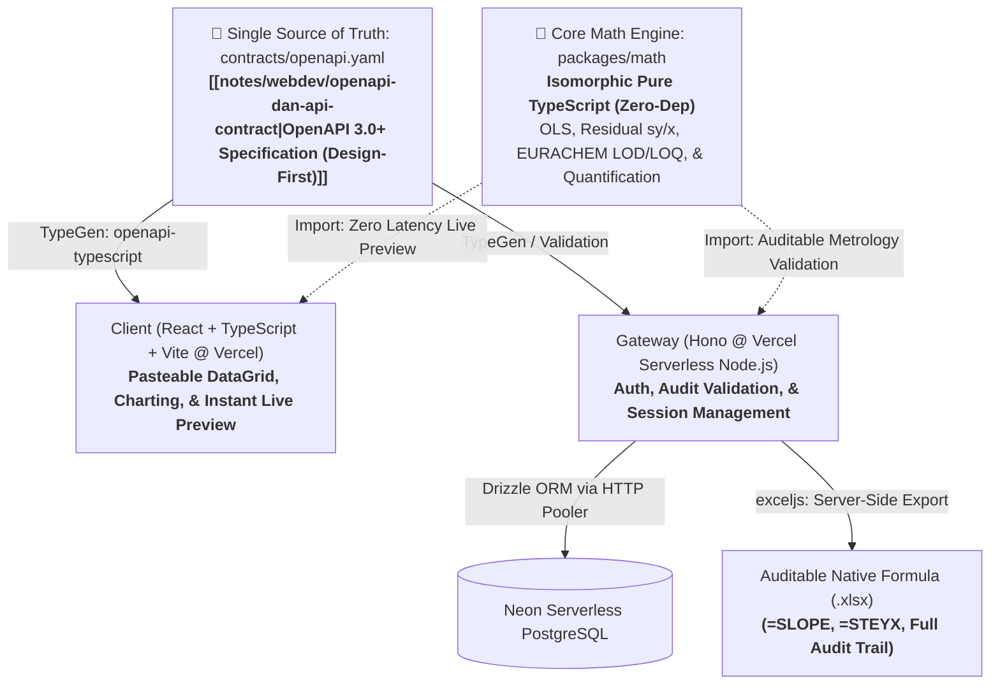

# 🧭 Project Context: valid-ex

> **Status**: Active Architecture & Clean Slate Monorepo  
> **Domain**: Analytical Chemistry Method Validation (ISO/IEC 17025 & EURACHEM Compliant)  
> **Repo Structure**: Monorepo (`projects/valid-ex`) via `pnpm`  
> **Architecture Decision Record**: [[notes/webdev/openapi-dan-api-contract|OpenAPI Specification (Design-First)]] | [[project-docs/valid-ex/ai-sparring/auth-schema-sparring|Auth Schema (Option 1)]]

---

## 🏛️ System Architecture Overview

---

## 🛡️ Core Architecture & Domain Agreements

### 1. API Architecture: Design-First OpenAPI
- **Standard**: [[notes/webdev/openapi-dan-api-contract|OpenAPI 3.0+]] with a **Design-First** approach.
- **Role**: The `contracts/openapi.yaml` file serves as the shared *Single Source of Truth (SSOT)* to facilitate tight collaboration between human developers and **Agentic AI**.
- **Automation**: The contract automatically generates TypeScript types for both Frontend and Backend, validates incoming requests in the Hono Gateway, and provides interactive Swagger UI documentation.

### 2. Repository Architecture: Modern pnpm Monorepo
- The monorepo structure is chosen to maximize *context sharing* for Agentic AI and prevent contract desynchronization across applications:
  - `apps/web/`: Frontend React + Vite + DataGrid + Charting (Deployed on Vercel).
  - `apps/gateway/`: Backend Hono API Gateway running on Vercel Serverless (Node.js runtime).
  - `packages/math/`: Core Metrological & Scientific Engine (Isomorphic Pure TypeScript, zero external dependencies, tested via Vitest).
  - `packages/contracts/`: The `openapi.yaml` specification and generated shared types (`@valid-ex/contracts`).

### 3. Authentication & Database Schema (Option 1 - Pragmatic Single Table)
- **Database**: Neon Serverless PostgreSQL via Drizzle ORM (Connected via `@neondatabase/serverless` HTTP pooler to prevent *connection starvation* in Vercel's serverless environment).
- **Authentication Strategy**: Single `users` table with a PostgreSQL `CHECK` constraint:
  - Local Email/Password: `password_hash` is mandatory.
  - Google OAuth: `password_hash` is `NULL`, `auth_provider = 'google'`, `google_id` is unique.
  - Prevents *null password bypass* and *account takeover* via email collision.
  - Full documentation: [[project-docs/valid-ex/ai-sparring/auth-schema-sparring|Auth Schema Sparring Record]].

### 4. Data Input & Parser: Dual-Mode Pasteable DataGrid
- **Input Interface**: **Clipboard Pasteable DataGrid** (zero regex fragility; analysts directly paste cell blocks from Excel via `Ctrl+C` $\to$ `Ctrl+V`).
- **Dual-Mode Signal** (mode hanya menentukan semantik `readings` SAMPEL; deret standar **selalu** memakai `signal` c/s):
  1. *Mode A (Raw Signal)*: `readings` sampel = respon detektor ($c/s$ / peak area) $\to$ Valid-Ex menghitung $C_{\text{sample}}$ via inverse regression $(y - c)/m$.
  2. *Mode B (Direct Concentration)*: `readings` sampel = konsentrasi in-vial hasil software alat (mis. ICP-MS Qtegra) $\to$ dipakai langsung. Kurva standar tetap dibangun dari `signal` untuk menurunkan LOD/LOQ instrumen dan mengevaluasi linearitas.

### 5. Metrology & Reporting Pipeline (ISO/IEC 17025 & EURACHEM)
- **Blank Correction**: $C_{\text{net}} = C_{\text{sample}} - C_{\text{blank}}$ (using Acid Digestion Method Blank / Blank Mars).
- **3-Zone Detection Limit Rules**:
  1. $C_{\text{net}} \le 0 \implies$ Reported as **`"Not Detected"` (ND)** (prevents negative value leakage).
  2. $C_{\text{net}} < \text{LOD}_{\text{instrument}} \implies$ **`"Not Detected"` (ND)**.
  3. $\text{LOD}_{\text{instrument}} \le C_{\text{net}} < \text{LOQ}_{\text{instrument}} \implies$ **`"< [LOQ_method]"`** (analyte qualitatively detected, but numerical reporting is prohibited due to $\%RSD > 10\%$).
  4. $C_{\text{net}} \ge \text{LOQ}_{\text{instrument}} \implies$ **Valid Quantification**, solid sample concentration is calculated in $\text{mg/kg}$:
     $$\text{Conc (mg/kg)} = \frac{(C_{\text{sample}} - C_{\text{blank}}) \times V_{\text{flask}}\ (\text{mL}) \times dF}{W_{\text{sample}}\ (\text{g}) \times 1000}$$
  - **Catatan**: gating 3-zona dilakukan di level larutan (`solutionConcUnit`). `LOQ_method` bersifat **per-sampel** (dari $V, dF, W$ sampel itu). Faktor `/1000` hanya valid untuk $\mu\text{g/L}$ (ppb); mesin hitung memakai tabel konversi dimensi eksplisit (anti-galat $1000\times$) — lihat [[project-docs/valid-ex/INVARIANTS|Invariant D3]].
- **QC Acceptance Criteria (Governed, Versioned Profiles — [[project-docs/valid-ex/adr/0007-governed-qc-criteria-profiles|ADR-0007]])**:
  - Kriteria QC **tidak di-hardcode**. Setiap batch mereferensikan `qcProfileId`; profil bernama, ber-versi, bersitasi `methodRef`, dan di-*snapshot* ke batch.
  - Struktur: per **analit** × per **tipe QC** (CCV / spike / duplo), dengan **band** rentang konsentrasi absolut. Kriteria flat = satu band catch-all.
  - **Profil default** (SOP Lab "QC CRITERIA CHECK" rev 1): $r \ge 0.995$; CCV recovery $90\% - 110\%$; Spike recovery $60\% - 115\%$; RPD $\le 25\%$.
  - Pemilih band: CCV → `expectedConc`; Spike → `spikeAdded`; Duplo → rata-rata $C_{\text{net}}$.
  - **Tanpa override** per batch; perubahan kriteria = versi profil baru.
- **Generative Audit Trail Spreadsheet**:
  - The Excel report generator runs on the Hono Gateway via `exceljs`.
  - In accordance with **Invariant D3**, all calculated cells MUST contain live native formula strings (e.g., `=SLOPE(...)`, `=STEYX(...)`, `=INTERCEPT(...)`), never static hardcoded numbers.

---

## 🎯 Active Goals & Milestones (Reset from Scratch)

- [x] **Milestone 1: API Contract Design (`packages/contracts/openapi.yaml`)**
  - Complete OpenAPI 3.0+ specification covering Auth, OLS Calibration, Sample Quantification, binary Spreadsheet Export, dan Governed QC Criteria Profiles.
- [ ] **Milestone 2: Monorepo Scaffolding & Core Math Engine (`@valid-ex/math`)** — 🔄 In Progress
  - Initialize pnpm workspace (`packages/contracts`, `packages/math`); `apps/*` ditunda ke Milestone 4/5.
  - Implement TDD (Vitest) for analytical chemistry math modules: OLS regression (centered, anti-cancellation), residual $s_{y/x}$, LOD/LOQ, unit-aware solid quantification, 3-zone censoring, banded QC criteria resolver, dan soft-flag QC gating.
  - Ground-truth anchoring: Python stdlib `statistics`, NIST StRD (OLS), SOP lab (kriteria QC), file lab nyata (E2E).
- [ ] **Milestone 3: Database Schema Setup & Drizzle ORM**
  - Configure Drizzle ORM with the Neon Serverless PostgreSQL driver (`@neondatabase/serverless`).
  - Define `users` table (Option 1 auth schema), `calibrations` table (with JSONB points), and audit logs.
- [ ] **Milestone 4: Gateway Implementation (Hono @ Vercel Serverless)**
  - Setup Hono API on Vercel with the Node.js adapter.
  - Integrate OpenAPI contract validation, JWT + Google OAuth, and ACID transactional persistence.
  - Implement Server-Side Excel Generator via `exceljs` (`GET /api/v1/calibrations/:id/export`).
- [ ] **Milestone 5: Frontend Implementation (React @ Vercel SPA)**
  - Setup Vite + React + TailwindCSS / UI component library.
  - Clipboard Pasteable DataGrid for calibration standards and sample batches.
  - Interactive calibration curve charting with *instant zero-latency preview* importing `@valid-ex/math`.
  - Dynamic metrological status badges (ND, < LOQ, QUANTIFIED, CCV Drift Alert).

---

## 🔮 Backlog & Future Milestones

- [ ] **Calculation Debugger / Step-by-Step Inspector**: Interactive audit panel inspecting every step of analyte quantification (from detector counts, blank subtraction, to solid gravimetric conversion) for complete metrological transparency (*Auditable Chemistry Calibration*).
- [ ] **Weighted Least Squares (WLS)**: Variance weighting ($1/x$ or $1/y^2$) to handle wide dynamic range heteroscedasticity on ICP-MS instruments.
- [ ] **Mandel's Fitting Test & Lack-of-Fit ANOVA**: Inferential curvature tests for advanced ISO 17025 method validation accreditation.

---

## ⚓ Key References & Knowledge Base

- [[notes/webdev/openapi-dan-api-contract|OpenAPI Specification, API Contract, dan Design-First Architecture]]
- [[notes/webdev/spec-invariants-dan-ai-alignment|Framework Spec & Invariants, Red Team Testing, dan AI Alignment]]
- [[notes/webdev/Database Migrations|Database Migrations & Data Integrity]]
- [[notes/analytical_chemistry/Validasi Metode/Equation|Validasi Metode: Persamaan Matematis, LOD/LOQ, & Evaluasi Data]]
- [[notes/analytical_chemistry/icp-ms-tuning-qc-dan-lab-sparring|Catatan Kritis ICP-MS: Regulasi QC ISO 17025 & Meja Preparasi]]
- EURACHEM Guide: *The Fitness for Purpose of Analytical Methods (2nd ed.)*
- ISO/IEC 17025:2017: *General requirements for the competence of testing and calibration laboratories*
