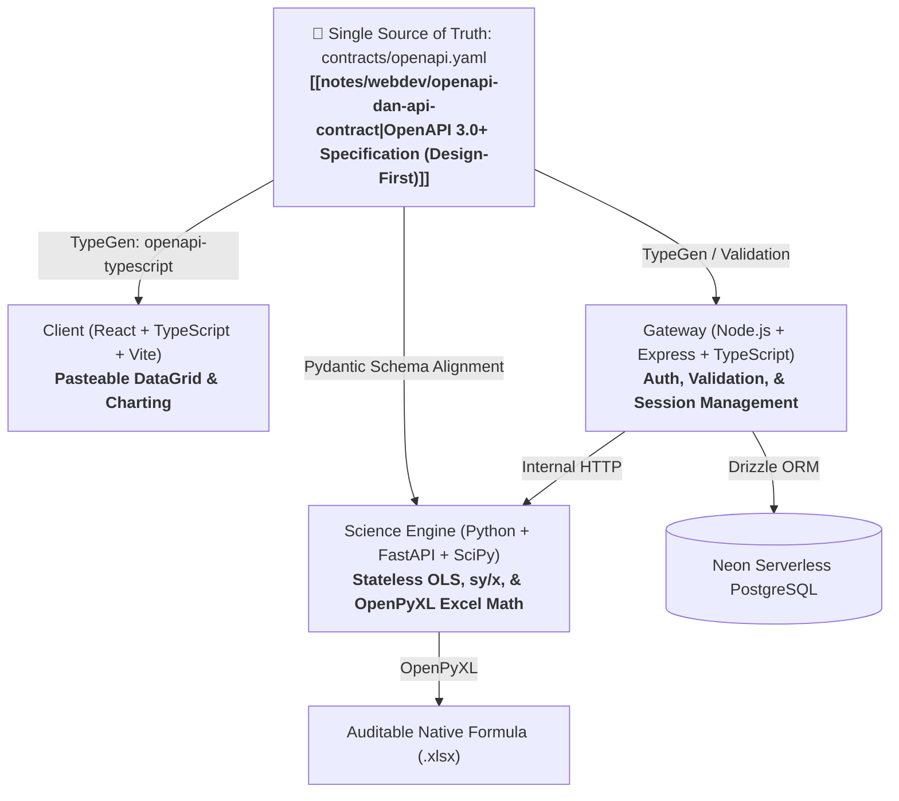

# 🧭 Project Context: valid-ex

> **Status**: Active Architecture & Design-First Specification  
> **Domain**: Analytical Chemistry Method Validation (ISO/IEC 17025 & EURACHEM Compliant)  
> **Repo Structure**: Monorepo (`projects/valid-ex`)  
> **Architecture Decision Record**: [[notes/webdev/openapi-dan-api-contract|OpenAPI Specification (Design-First)]] | [[project-docs/valid-ex/ai-sparring/auth-schema-sparring|Auth Schema (Option 1)]]

---

## 🏛️ System Architecture Overview

---

## 🛡️ Core Architecture & Domain Agreements

### 1. API Architecture: Design-First OpenAPI
- **Standard**: [[notes/webdev/openapi-dan-api-contract|OpenAPI 3.0+]] dengan pendekatan **Design-First**.
- **Peran**: File `contracts/openapi.yaml` menjadi *Single Source of Truth (SSOT)* bersama untuk memfasilitasi kolaborasi erat antara developer dan **Agentic AI**.
- **Otomatisasi**: Kontrak men-generate tipe TypeScript di Frontend dan Backend secara otomatis, memvalidasi request di Gateway Express, serta menyediakan dokumentasi interaktif Swagger UI.

### 2. Repository Architecture: Monorepo
- Struktur monorepo dipilih untuk memaksimalkan *context sharing* bagi Agentic AI dan mencegah desinkronisasi kontrak:
  - `apps/web/`: Frontend React + Vite + DataGrid.
  - `apps/gateway/`: Express + TypeScript API Gateway.
  - `services/science/`: Python + FastAPI + SciPy Engine.
  - `packages/contracts/`: File `openapi.yaml` dan generated shared types.

### 3. Autentikasi & Database Schema (Option 1 - Pragmatic Single Table)
- **Database**: Neon Serverless PostgreSQL via Drizzle ORM.
- **Strategi Autentikasi**: Single table `users` dengan PostgreSQL `CHECK` constraint:
  - Email/Password lokal: `password_hash` wajib ada.
  - Google OAuth: `password_hash` bernilai `NULL`, `auth_provider = 'google'`, `google_id` unik.
  - Mencegah *null password bypass* dan *account takeover* via email collision.
  - Dokumentasi lengkap: [[project-docs/valid-ex/ai-sparring/auth-schema-sparring|Auth Schema Sparring Record]].

### 4. Input Data & Parser: Dual-Mode Pasteable DataGrid
- **Antarmuka Input**: **Clipboard Pasteable DataGrid** (zero regex fragility, analis mem-paste langsung blok sel dari Excel via `Ctrl+C` $\to$ `Ctrl+V`).
- **Dual-Mode Sinyal**:
  1. *Mode A (Raw Signal)*: Input $x$ konsentrasi standar teoretis dan $y$ respon detektor ($c/s$ / luas area) $\to$ Valid-Ex menghitung slope ($m$) dan intercept ($c$).
  2. *Mode B (Direct Concentration)*: Input konsentrasi terhitung dalam vial dari instrumen modern (misal ICP-MS Qtegra) $\to$ Valid-Ex memverifikasi residual OLS, koreksi blanko, dan validasi QC.

### 5. Metrologi & Pipeline Pelaporan (ISO/IEC 17025 & EURACHEM)
- **Koreksi Blanko**: $C_{\text{net}} = C_{\text{sample}} - C_{\text{blank}}$ (menggunakan Blanko Destruksi Asam / Method Blank).
- **Aturan Batas Deteksi 3-Zona**:
  1. $C_{\text{net}} \le 0 \implies$ Dilaporkan sebagai **`"Not Detected"` (ND)** (mencegah kebocoran angka negatif).
  2. $C_{\text{net}} < \text{LOD}_{\text{instrumen}} \implies$ **`"Not Detected"` (ND)**.
  3. $\text{LOD}_{\text{instrumen}} \le C_{\text{net}} < \text{LOQ}_{\text{instrumen}} \implies$ **`"< [LOQ_metode]"`** (analit terdeteksi kualitatif, namun dilarang dilaporkan dalam angka numerik karena $\%RSD > 10\%$).
  4. $C_{\text{net}} \ge \text{LOQ}_{\text{instrumen}} \implies$ **Kuantifikasi Sah**, dihitung kadar padatannya dalam $\text{mg/kg}$:
     $$\text{Conc (mg/kg)} = \frac{(C_{\text{sample}} - C_{\text{blank}}) \times V_{\text{labu}}\ (\text{mL}) \times dF}{W_{\text{timbang}}\ (\text{g}) \times 1000}$$
- **Kriteria Keberterimaan QC**:
  - Linearitas Kurva: Koefisien korelasi Pearson $r > 0.995$.
  - Continuing Calibration Verification (CCV): $100 \pm 10\%$.
  - Matrix Spike Recovery: $60 - 115\%$ (atau $70 - 130\%$).
  - Presisi Duplo (RPD): $\le 25\%$.

---

## 🎯 Active Goals & Milestones

- [x] Selesai: Formulasi Domain Context & Resolusi Dilema Metrologi (LOD/LOQ, Dual Mode, Parser).
- [x] Milestone 1: Desain Kontrak `contracts/openapi.yaml` (Endpoints Auth, Calibration, Quantification).
- [x] Milestone 2: Setup Scaffolding Monorepo & Skema Drizzle ORM di Neon Serverless Postgres.
- [ ] Milestone 3: Implementasi Python Scientific Engine (OLS regression, $s_{y/x}$ residual, LOD/LOQ EURACHEM).
- [ ] Milestone 4: Implementasi Gateway Hono (Cloudflare Workers, Type-safe API via `@valid-ex/contracts`, Auth JWT + Google OAuth).
- [ ] Milestone 5: Implementasi Frontend React (Vite, Pasteable DataGrid, Charting, Dynamic Error Badges).
- [ ] Milestone 6: OpenPyXL Dynamic Formula Generator (Live Native Excel formulas: `=SLOPE()`, `=STEYX()`).

---

## 🔮 Backlog & Future Milestones

- [ ] **Calculation Debugger / Step-by-Step Inspector**: Panel interaktif untuk mengaudit setiap tahapan kalkulasi analit (dari pulsa sinyal instrumen, koreksi blanko, hingga faktor gravimetri padatan) guna menghadirkan transparansi penuh (*Auditable Chemistry Calibration*).
- [ ] **Weighted Least Squares (WLS)**: Pembobotan varians $1/x$ atau $1/y^2$ untuk mengatasi heteroskedastisitas kurva rentang lebar.

---

## ⚓ Key References & Knowledge Base

- [[notes/webdev/openapi-dan-api-contract|OpenAPI Specification, API Contract, dan Design-First Architecture]]
- [[notes/webdev/spec-invariants-dan-ai-alignment|Framework Spec & Invariants, Red Team Testing, dan AI Alignment]]
- [[notes/webdev/Database Migrations|Database Migrations & Data Integrity]]
- [[notes/analytical_chemistry/Validasi Metode/Equation|Validasi Metode: Persamaan Matematis, LOD/LOQ, & Evaluasi Data]]
- [[notes/analytical_chemistry/icp-ms-tuning-qc-dan-lab-sparring|Catatan Kritis ICP-MS: Regulasi QC ISO 17025 & Meja Preparasi]]
- EURACHEM Guide: *The Fitness for Purpose of Analytical Methods (2nd ed.)*
- ISO/IEC 17025:2017: *General requirements for the competence of testing and calibration laboratories*
